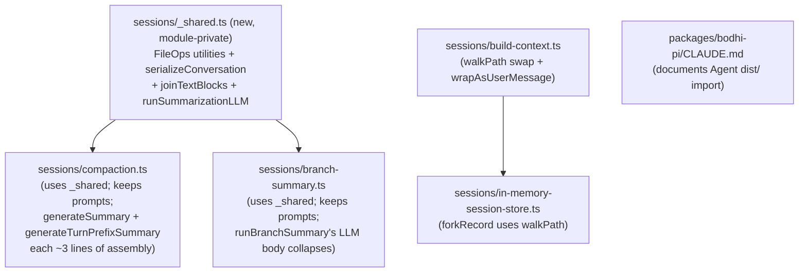

# Batch 2 — sessions module dedup (Batches C + D + bonus walkPath)

Closes Batches C (compaction.ts ↔ branch-summary.ts duplication) and D (build-context.ts cleanup) of [ai-docs/reviews/2026-05-11-bodhi-pi-tech-debt.md](ai-docs/reviews/2026-05-11-bodhi-pi-tech-debt.md). Implements per the kickoff at [ai-docs/reviews/kickoff-batch-2-sessions-dedup.md](ai-docs/reviews/kickoff-batch-2-sessions-dedup.md), the review-driven workflow at [ai-docs/reviews/process.md](ai-docs/reviews/process.md), and the matrix-wide rules at [ai-docs/prompts/process.md](ai-docs/prompts/process.md).

Bonus: an additional `walkPath` clone discovered in [packages/bodhi-pi/src/sessions/in-memory-session-store.ts:64-70](packages/bodhi-pi/src/sessions/in-memory-session-store.ts) is folded in (same family of duplication, same module group). Two text-block-extraction patterns (also repeated 7× across the same files) are folded into a `joinTextBlocks` helper.

## Locked decisions

1. **Single shared module, flat layout.** New file [packages/bodhi-pi/src/sessions/_shared.ts](packages/bodhi-pi/src/sessions/_shared.ts) holds the shared primitives. We do NOT mirror upstream's `compaction/` subfolder — bodhi-pi keeps its existing flat `sessions/` layout to minimize the diff and avoid file-move noise.
2. **Module-private, no public-export drift.** `_shared.ts` is not added to [packages/bodhi-pi/src/index.ts](packages/bodhi-pi/src/index.ts). Matches the existing `walkPath` precedent (also `export function` but not in the package barrel).
3. **`runSummarizationLLM` IS extracted.** (Reversal of the earlier "follow upstream and don't extract" stance — see "On `runSummarizationLLM`" below for the analysis.) The wrapper goes in `_shared.ts`. Each of the three LLM call sites (`generateSummary`, `generateTurnPrefixSummary`, `runBranchSummary`) collapses to ~3 lines of prompt assembly + a `runSummarizationLLM(...)` call.
4. **`serializeConversation` is parameter-free.** Always includes thinking blocks, always truncates tool results at 2000 chars (upstream behavior). branch-summary's current `.slice(0, 800)` + skip-thinking divergence is removed; this aligns it with compaction.ts and matches upstream. Verified the `/Outcome/` regex in [packages/bodhi-pi/test/branch-summary.test.ts:32](packages/bodhi-pi/test/branch-summary.test.ts) is unaffected (it matches a string in the prompt body, not in the conversation).
5. **System prompts and prompt bodies stay where they are.** Each module owns its own prompts. Touching them changes LLM output and would break test mocks.
6. **`walkPath` swap is safe — all real call paths are covered.** Every caller of `buildSessionContext` in [packages/bodhi-pi/src/acp/agent.ts](packages/bodhi-pi/src/acp/agent.ts) passes either a non-null `leafId` (`session.leafId` or an explicit entry id) or relies on the empty-entries early return at lines 92-94. The single legacy fixture at [packages/bodhi-pi/test/build-context.test.ts:109](packages/bodhi-pi/test/build-context.test.ts) uses entries WITHOUT `parentId` (`haveParentLinks === false`), which `walkPath` already handles via its `entries.slice()` branch — exact behavioral match. The `targetLeaf === null && haveParentLinks === true` case I worried about earlier doesn't exist in production code (every `appendEntry` sets `record.leafId`) and isn't exercised by any test.
7. **D.2 message-wrapper consolidation is bodhi-pi-specific.** Upstream uses custom AgentMessage roles (`role: "branchSummary"` etc.); bodhi-pi's AgentMessage is `Message`-only and synthesizes via user-role messages with XML tags. Per the kickoff: one `wrapAsUserMessage(text, timestamp)` helper + three thin formatters that own only the body shape.
8. **`Agent from "/dist/agent.js"` import is intentional and stays.** [packages/bodhi-pi/src/acp/agent.ts:38](packages/bodhi-pi/src/acp/agent.ts) deliberately imports `Agent` from `@earendil-works/pi-agent-core/dist/agent.js`, NOT from the package barrel. This batch documents the rationale in [packages/bodhi-pi/CLAUDE.md](packages/bodhi-pi/CLAUDE.md). Review finding A.3 is obsolete (proposed the opposite).
9. **In-memory store's `forkRecord` walkPath clone is in scope.** Same module group, same family of duplication. Out-of-scope (and noted as a follow-up): the SQLite store at [packages/bodhi-pi-node/src/sessions/sqlite-session-store.ts:219-226](packages/bodhi-pi-node/src/sessions/sqlite-session-store.ts) and the Dexie store at [packages/bodhi-pi-browser/src/sessions/dexie-session-store.ts:167-174](packages/bodhi-pi-browser/src/sessions/dexie-session-store.ts) have the same shape but operate on row-wrapped entries; deduplicating them would need a generic `walkChain<T>({ getId, getParentId })` helper that's out of scope for this batch.

## On `runSummarizationLLM` — re-analysis

I dropped this from the plan earlier on the grounds that upstream's `packages/coding-agent/src/core/compaction/{compaction,branch-summarization}.ts` does NOT extract the wrapper. After re-reading, the upstream argument doesn't apply to bodhi-pi:

**Upstream's three call sites have HETEROGENEOUS handling**:
- `generateBranchSummary` returns `{aborted: true} | {error: string} | {summary, readFiles, modifiedFiles}` (three response shapes).
- `compact` does its own response-handling.
- `generateSummary` does its own response-handling.

Each branches on `stopReason` ("aborted" vs "error" vs success) and returns a different result type. They can't share a wrapper because the post-call shape varies.

**bodhi-pi's three call sites have HOMOGENEOUS handling** (compaction.ts:435-474, :476-501, branch-summary.ts:140-156):

```text
const messages: Message[] = [{ role: "user", content: [{ type: "text", text: promptText }], timestamp: Date.now() }];
const response = await completeSimple(model, { systemPrompt, messages }, { maxTokens, signal?, apiKey });
if (response.stopReason === "error") throw new Error(`<prefix>: ${response.errorMessage ?? "unknown error"}`);
return response.content
  .filter((c): c is { type: "text"; text: string } => c.type === "text")
  .map((c) => c.text)
  .join("\n");
```

That's ~10 lines, identical except for the prompt text + system prompt + maxTokens + error prefix. Three callers × 10 lines = 30 lines of duplicated envelope/error/extract code.

**Wrapper signature** (~12 lines, one place):

```ts
export async function runSummarizationLLM(
  model: Model<Api>,
  systemPrompt: string,
  userPromptText: string,
  options: { apiKey: string; maxTokens: number; signal?: AbortSignal; errorPrefix: string },
): Promise<string> {
  const messages: Message[] = [{ role: "user", content: [{ type: "text", text: userPromptText }], timestamp: Date.now() }];
  const response = await completeSimple(
    model,
    { systemPrompt, messages },
    { maxTokens: options.maxTokens, ...(options.signal ? { signal: options.signal } : {}), apiKey: options.apiKey },
  );
  if (response.stopReason === "error") throw new Error(`${options.errorPrefix}: ${response.errorMessage ?? "unknown error"}`);
  return joinTextBlocks(response.content, "\n");
}
```

**Each caller becomes pure prompt-assembly**:

```ts
async function generateSummary(currentMessages, model, reserveTokens, apiKey, customInstructions?, previousSummary?, signal?) {
  let basePrompt = previousSummary ? UPDATE_SUMMARIZATION_PROMPT : SUMMARIZATION_PROMPT;
  if (customInstructions) basePrompt = `${basePrompt}\n\nAdditional focus: ${customInstructions}`;
  const conversationText = serializeConversation(currentMessages as Message[]);
  let promptText = `<conversation>\n${conversationText}\n</conversation>\n\n`;
  if (previousSummary) promptText += `<previous-summary>\n${previousSummary}\n</previous-summary>\n\n`;
  promptText += basePrompt;
  return runSummarizationLLM(model, SUMMARIZATION_SYSTEM_PROMPT, promptText, {
    apiKey,
    maxTokens: Math.floor(0.8 * reserveTokens),
    ...(signal ? { signal } : {}),
    errorPrefix: "Summarization failed",
  });
}
```

**Why this is worth it**:

- Net code reduction: ~30 lines deleted, ~12 lines added — net ~18 LOC + a testable surface.
- Locality: "how do we call the LLM for summarization" is in ONE place. Future cross-cutting changes (request headers, structured outputs, retry logic, telemetry hooks) are a single edit.
- Each caller's body becomes self-evidently "build prompt, hand off." Reader doesn't need to verify the message envelope is built right or the error check is uniform.
- Testable in isolation: a single `runSummarizationLLM` test can assert envelope shape, error rethrow, text extraction across all three call paths via parameterization. Today each caller's tests have to re-prove the envelope/error/extract behavior end-to-end.
- The wrapper is small (~12 lines), pure, no closures over state — it's the textbook case for extraction.

The reason upstream doesn't extract is that their three call sites genuinely DO different things post-call. bodhi-pi's three call sites genuinely DO the same thing post-call. Extracting here is sound.

## Additional cleanup found during exploration

**Text-block extraction pattern repeated 7×** across compaction.ts (lines 338, 362, 471, 498) and branch-summary.ts (lines 73, 91, 154):

```ts
.filter((b): b is { type: "text"; text: string } => b.type === "text")
.map((b) => b.text)
.join(separator);
```

Add `joinTextBlocks(content, separator)` to `_shared.ts`. Each call site collapses to one line. The new `runSummarizationLLM` uses it for response-text extraction; `serializeConversation` uses it twice internally; the existing throw-on-error `.content` extractions become one line each.

**`forkRecord` walkPath clone in [in-memory-session-store.ts:64-70](packages/bodhi-pi/src/sessions/in-memory-session-store.ts)**:

The chain-walk inside `forkRecord` is the same parentId walk as `walkPath` but on a `byId` built from `source.entries`. Replace with `walkPath(source.entries, fromEntryId)` and slice off the last element when `position === "before"`. The `byId.has(fromEntryId)` precondition check stays (turns into a check on `walkPath`'s return).

**Out-of-scope follow-ups** (note in the review):
- Same chain-walk duplicated in [packages/bodhi-pi-node/src/sessions/sqlite-session-store.ts:219-226](packages/bodhi-pi-node/src/sessions/sqlite-session-store.ts) (operates on row-wrapped entries).
- Same chain-walk duplicated in [packages/bodhi-pi-browser/src/sessions/dexie-session-store.ts:167-174](packages/bodhi-pi-browser/src/sessions/dexie-session-store.ts) (operates on Dexie row-wrapped entries).
- A future generic `walkChain<T>({ getId, getParentId })` would unify all three; defer until there's a third caller (the YAGNI threshold).

## Scope summary



## File-by-file changes

### New: [packages/bodhi-pi/src/sessions/_shared.ts](packages/bodhi-pi/src/sessions/_shared.ts)

Exports (module-private; not in `src/index.ts`):

- `FileOps` interface (read/written/edited Sets)
- `newFileOps(): FileOps`
- `extractFileOpsFromMessage(message, ops): void` — handles read/write/edit tool calls
- `computeFileLists(ops): { readFiles: string[]; modifiedFiles: string[] }` — same shape as `CompactionDetails`
- `formatFileOperations(readFiles, modifiedFiles): string` — XML wrap matching current `compaction.ts:64-73`. Takes the two arrays directly (matches upstream's signature)
- `joinTextBlocks(content, separator?): string` — extracts text blocks and joins
- `serializeConversation(messages: Message[]): string` — parameter-free; always includes thinking, truncates tool results at 2000 chars
- `runSummarizationLLM(model, systemPrompt, userPromptText, { apiKey, maxTokens, signal?, errorPrefix }): Promise<string>` — see analysis above

JSDoc only where it explains a non-obvious invariant (per [packages/bodhi-pi/CLAUDE.md](packages/bodhi-pi/CLAUDE.md) "Comments policy").

### Modified: [packages/bodhi-pi/src/sessions/compaction.ts](packages/bodhi-pi/src/sessions/compaction.ts)

- Delete lines 25-73 (`FileOps`, `newFileOps`, `extractFileOpsFromMessage`, `computeFileLists`, `formatFileOperations`).
- Delete lines 323-328 (`TOOL_RESULT_MAX_CHARS`, `truncateForSummary`).
- Delete lines 330-369 (`serializeConversation`).
- Collapse lines 435-474 (`generateSummary`) and lines 476-501 (`generateTurnPrefixSummary`) — each becomes ~10 lines of prompt assembly + `runSummarizationLLM` call.
- Add `import { ... } from "./_shared.js";`.
- The exported `CompactionPreparation` interface keeps `fileOps: FileOps` (now imported from `_shared.ts`).
- Public exports of compaction.ts unchanged.

### Modified: [packages/bodhi-pi/src/sessions/branch-summary.ts](packages/bodhi-pi/src/sessions/branch-summary.ts)

- Delete lines 47-63 (local `FileOps` + `extractFileOps`).
- Delete lines 65-98 (local `serializeConversation` with the `.slice(0, 800)` divergence).
- Delete the inline `computeFileLists` block at lines 158-162.
- Collapse the inline LLM call body at lines 140-156 — becomes ~5 lines of prompt assembly + `runSummarizationLLM` call.
- Add `import { ... } from "./_shared.js";`.
- Public exports unchanged: `detectCrossBranch`, `runBranchSummary`, `BranchSummaryResult`.
- **Behavior change** (intentional, aligns with compaction.ts and upstream): tool-result truncation moves from 800 to 2000 chars; thinking blocks now included in the serialized request. The `/Outcome/` regex in `branch-summary.test.ts:32` matches the prompt body, not the conversation content — test stays green.

### Modified: [packages/bodhi-pi/src/sessions/build-context.ts](packages/bodhi-pi/src/sessions/build-context.ts)

- D.1: Replace inline chain-walk at lines 96-108 with `const path = walkPath(entries, targetLeaf);`. Drop the now-unused local `byId` (verify no other use in the function).
- D.2: Add a private `wrapAsUserMessage(text: string, timestamp: number): AgentMessage` helper. The three formatters become one-liners that compose the tagged body and call `wrapAsUserMessage`.
- Public exports unchanged.

### Modified: [packages/bodhi-pi/src/sessions/in-memory-session-store.ts](packages/bodhi-pi/src/sessions/in-memory-session-store.ts)

- Replace lines 60-71 (build `byId`, walk chain) with `const chain = walkPath(source.entries, fromEntryId);` followed by the existing precondition (`if (chain.length === 0) throw ...`) and the existing `position === "before" ? chain.slice(0, -1) : chain` slice.
- Add `import { walkPath } from "./build-context.js";`.

### New: [packages/bodhi-pi/src/sessions/_shared.test.ts](packages/bodhi-pi/src/sessions/_shared.test.ts)

Colocated unit tests, narrowing-helper style (no `if/else`):

- `extractFileOpsFromMessage`: assistant message with read/write/edit tool calls populates the right Sets; non-assistant messages are no-ops; missing/invalid `args.path` is skipped.
- `computeFileLists`: file appearing in both `read` and `edited` lands only in `modifiedFiles`; output arrays sorted; pure-read file lands only in `readFiles`.
- `formatFileOperations`: empty inputs return `""`; populated inputs render the XML tag wrap; both sections render together.
- `serializeConversation`: user/assistant/toolResult message rendering; thinking blocks ARE included; tool result over 2000 chars is truncated with the `[... N more characters truncated]` marker.
- `joinTextBlocks`: text-only blocks pass through; non-text blocks are filtered; separator is honored.
- `runSummarizationLLM`: using a faux model registered via `registerFauxProvider` — happy path returns joined text, error path throws with the supplied `errorPrefix`, abort signal is forwarded.

### Modified: [packages/bodhi-pi/CLAUDE.md](packages/bodhi-pi/CLAUDE.md)

Add a new top-level section "## pi-agent-core import policy":

> The agent imports `Agent` directly from `@earendil-works/pi-agent-core/dist/agent.js` (see [packages/bodhi-pi/src/acp/agent.ts:38](packages/bodhi-pi/src/acp/agent.ts)) rather than from the package barrel. This is INTENTIONAL and must not be "fixed":
>
> - Upstream `packages/agent` is no longer runtime-neutral. Its barrel re-exports `harness/session/repo/jsonl.ts`, `harness/session/storage/jsonl.ts`, `harness/session/storage/memory.ts`, `harness/utils/shell-output.ts`, and `harness/env/nodejs.ts` — all of which directly import `node:child_process`, `node:crypto`, `node:fs`, `node:fs/promises`, `node:os`, `node:path`, `node:tls`, `node:tmpdir`.
> - bodhi-pi must run in browser-shipped runtimes (`bodhi-pi-browser`, `bodhi-pi-web`, `bodhi-pi-chrome-ext`). Importing the barrel pulls in the Node-only modules transitively; bundlers' tree-shaking does not reliably strip them because the harness modules have side-effecting top-level imports.
> - The `dist/agent.js` deep import gives us only the `Agent` class plus its `pi-ai` dependencies — no Node-specific transitive baggage. Tree-shaking is irrelevant because the import graph is already minimal.
> - Review finding A.3 in `ai-docs/reviews/2026-05-11-bodhi-pi-tech-debt.md` proposed the opposite swap. That finding is obsolete; the analysis above supersedes it. Marked obsolete in the review's Progress table by this batch.
>
> Other type-only imports from `@earendil-works/pi-agent-core` (e.g., `AgentMessage`, `AgentTool`) are fine — they erase at compile time and don't pull runtime modules.

## Acceptance criteria

1. `npx vitest run` from [packages/bodhi-pi](packages/bodhi-pi) green; existing 321 tests untouched, plus new `_shared.test.ts` cases.
2. `e2e/compaction.e2e.ts` (real `gpt-4o-mini`) green unchanged.
3. Each downstream PoC's `npx vitest run` green unchanged, in this order: bodhi-pi-node, bodhi-pi-cli, bodhi-pi-browser, bodhi-pi-web, bodhi-pi-chrome-ext, bodhi-pi-http, bodhi-pi-ws-server, bodhi-pi-ws-frontend.
4. `just test` from repo root green at the end.
5. `npx tsgo --noEmit` clean across all 9 packages (modulo the pre-existing `BootstrapResult` errors in web/chrome-ext noted in batch 1's verification).
6. `npx biome check` clean.
7. Public exports of [packages/bodhi-pi/src/index.ts](packages/bodhi-pi/src/index.ts) byte-identical before/after.

## Verification sequence (the standardized workflow)

Per the user's directive (and to be added to [ai-docs/reviews/process.md](ai-docs/reviews/process.md) as the standard order):

1. **bodhi-pi core complete first.** Make ALL bodhi-pi changes; then run `npx vitest run` (unit + integration) + `e2e/compaction.e2e.ts` from `packages/bodhi-pi`. Get green.
2. **Rebuild bodhi-pi `dist/`** (`npm run build` in `packages/bodhi-pi`). Required because downstream hosts consume `@bodhiapp/bodhi-pi` from `dist/` at typecheck time.
3. **Per-host verification** in this exact order. For each: `npx vitest run` (or the host's equivalent) + any e2e the host has. Get green before moving to the next.
   1. `packages/bodhi-pi-node`
   2. `packages/bodhi-pi-cli`
   3. `packages/bodhi-pi-browser`
   4. `packages/bodhi-pi-web`
   5. `packages/bodhi-pi-chrome-ext`
   6. `packages/bodhi-pi-http`
   7. `packages/bodhi-pi-ws-server`
   8. `packages/bodhi-pi-ws-frontend`
4. **`just test` from repo root.** Final matrix sanity check. Anything that broke without surfacing in steps 1–3 is a regression in a path we don't otherwise hit.
5. **`npm run check` from repo root.** Full biome + tsgo sweep.

## Doc updates

- [packages/bodhi-pi/CHANGELOG.md](packages/bodhi-pi/CHANGELOG.md): one `### Changed` entry under `[Unreleased]`. Sample wording: `Internal: dedup FileOps tracking, message serialization, and the LLM summarization wrapper between compaction and branch-summary helpers; reuse walkPath inside in-memory-session-store.forkRecord; consolidate three message wrappers in build-context.ts. branch-summary's tool-result truncation moves from 800 to 2000 chars and now includes thinking blocks (aligns with compaction and upstream).`
- [ai-docs/reviews/2026-05-11-bodhi-pi-tech-debt.md](ai-docs/reviews/2026-05-11-bodhi-pi-tech-debt.md):
  - Flip Progress table rows C and D from 🔜 → ✅ with `(implemented in batch-2-sessions-dedup)`.
  - Flip Batch sequence row 2 status to ✅.
  - Mark A.3 in Progress as `obsolete (kept dist/ import; see packages/bodhi-pi/CLAUDE.md "pi-agent-core import policy")`.
  - Add Decision log entries (date-stamped, one line each) for the locked decisions above plus the A.3 reversal.
- [ai-docs/reviews/process.md](ai-docs/reviews/process.md): add a new section "## Standard verification sequence" listing steps 1–5 above; add a "## What worked / what didn't (batch 2 retrospective)" section captured during/after this batch.
- [packages/bodhi-pi/CLAUDE.md](packages/bodhi-pi/CLAUDE.md): new "## pi-agent-core import policy" section (content above).

## Next batch kickoff

This batch creates [ai-docs/reviews/kickoff-batch-3-agent-decomposition.md](ai-docs/reviews/kickoff-batch-3-agent-decomposition.md) for Batch B (`agent.ts` decomposition; review file lines 75-122). Style requirements per the user:

- **Exploratory and directional**, not prescriptive. State the current state, the desired end state, and rough pointers. Do NOT enumerate "edit line X to Y."
- Mirror group-2 prompt style: "Read first" links, "Functional outcomes," "Rough directional pointers," "Test signals to design for," "Open questions to confirm before coding," "Boundaries (in scope / out of scope)."
- Include the standardized verification sequence (bodhi-pi → 8 hosts in order → `just test` → `npm run check`).
- Reference Decision log entries from batch 2 (especially decision #8 about the `Agent` import) so the implementer doesn't accidentally regress them.
- Note that B.5 (`runAndPersistCompaction`) and B.6 (`makeCompactionEntry`) interact with the helpers introduced in batch 2 — the implementer should re-read `_shared.ts` and the new `runSummarizationLLM` wrapper before extracting `runAndPersistCompaction`, since the natural shape of that helper now closes over fewer things than the audit assumed.

The kickoff is drafted at the end of batch 2, AFTER the verification step succeeds (per process.md rule "draft the kickoff only when the previous batch is shipped").

## Out of scope (per kickoff "Boundaries")

- Batch B (`agent.ts` decomposition) itself — that is batch 3, kicked off by the file this batch creates.
- Batch F (`EXT_SESSION_CONFIG` slimdown / capability advertisement) — queued at batch 4.
- Batch E.4 (`advertiseSlashable` refresh hook) — queued at batch 5.
- Batch H (test helper extraction + e2e gap fills) — queued at batch 6.
- Same chain-walk duplication in `bodhi-pi-node`'s SQLite store and `bodhi-pi-browser`'s Dexie store. Noted as a follow-up finding in the review; would need a generic `walkChain<T>` to unify all three.
- Any change to system prompts, prompt bodies, or LLM-facing content beyond the serialization-format normalization.
- Any host code beyond import-fix mechanics (this batch is bodhi-pi-internal; the in-memory store IS bodhi-pi-internal).
