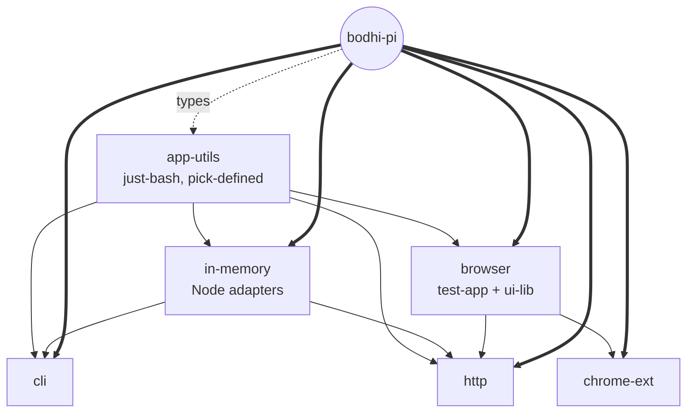

# Plan — test-apps restructure + e2e/e2e-ui decoupling (8-commit stack)

> Approved via Ultraplan refinement on 2026-05-14. Supersedes the prior
> `ai-docs/reviews/2026-05-14-e2e-shared-cleanup.md` review.

## Context

`packages/bodhi-pi/e2e/` today houses both the vitest e2e specs/harness AND four
runnable test-app packages (`test-app-{cli,http,browser,chrome-ext}`) plus a
shared `app-utils/` tree (Node side under `app-utils/cli/`, browser side under
`app-utils/browser/`). This creates two problems:

1. **Shape mismatch.** Both `packages/bodhi-pi/e2e/` (vitest) and
   `packages/bodhi-pi/e2e-ui/` (Playwright) consume the same test-apps, yet
   the test-apps live under one of them. `e2e-ui/playwright.config.ts:10-11`
   already reaches sideways into `../e2e/test-app-*`.
2. **Coupling.** Test-apps import three primitives out of `e2e/helpers/`
   (`createNodeFilesystem`, `pickDefined`, `createNodePackageExtensionLoader`)
   via the `@e2e/*` alias. Conversely, the vitest harness reaches into
   `e2e/app-utils/` for its own helpers (e.g. `e2e/helpers/seed-bodhi-pi.ts:4`
   imports the extension loader). The UI also has dead-code clusters in
   `test-app-http/src/frontend/{components,hooks,ui,lib}` from the
   pre-`AppShell` era, missing `data-test-state` coverage, and unstyled
   pages that pale next to the polished `bodhi-pi-web` reference.

User constraints:
- **Single stacked PR, 8 commits** (one per batch A–H below). Each commit
  remains independently reviewable.
- **`test-apps/` is standalone** — its source must not import from `e2e/`
  or `e2e-ui/`. Conversely, `e2e/` and `e2e-ui/` are blackbox suites that
  reach test-apps only via process spawn (Playwright `webServer`, vitest
  `global-setup`).
- **Keep `react-router-dom`** in `test-app-http/`. Collapse the App/WsApp
  twins to one component-with-adapter-prop, NOT the routes.

Intended outcome: `packages/bodhi-pi/test-apps/` is a peer of `e2e/` and
`e2e-ui/`. Post-merge, `grep -rn "@e2e/" packages/bodhi-pi/test-apps/`
returns zero hits; `grep -rn "test-apps/" packages/bodhi-pi/e2e* --include="*.ts"`
hits only Playwright/vitest config files.

## Target tree

```
packages/bodhi-pi/
├── src/                        (unchanged; gains LIFECYCLE_EVENT_METHOD in src/wire/constants.ts)
├── test/                       (unchanged)
├── e2e/                        (vitest specs + harness; STANDALONE)
│   ├── helpers/
│   │   ├── node-adapters/      (stays; consumed only by e2e harness)
│   │   ├── pick-defined.ts     (stays; consumed only by e2e harness)
│   │   ├── extension-loaders/  (stays; consumed by seed-bodhi-pi.ts)
│   │   └── {browser,chrome-ext,cli,http,ws,in-memory}/ (+ misc)
│   ├── shared/ + cli-headless/ + setup/ + data/  (unchanged)
│   └── global-setup.ts         (paths to test-apps updated)
├── e2e-ui/                     (Playwright; STANDALONE blackbox)
│   ├── playwright.config.ts    (paths to test-apps updated)
│   ├── global-setup.ts         (chrome-ext build path updated)
│   ├── helpers/chrome-ext.ts   (path updated)
│   └── (fixtures/pages/specs shape preserved)
└── test-apps/                  (NEW; six workspaces)
    ├── .gitignore
    ├── app-utils/              (just-bash-terminal, just-bash-fs-adapter, pick-defined)
    ├── in-memory/              (Node in-process adapters; kv-store, sessions, script-executor, node-filesystem, ext-loader)
    ├── browser/                (browser test-app + shared ui-lib/ tree)
    ├── chrome-ext/             (MV3 test-app; depends on browser)
    ├── cli/                    (Node CLI test-app; depends on in-memory + app-utils)
    └── http/                   (HTTP+WS test-app; server uses in-memory + app-utils; frontend uses browser)
```

Workspace dependency graph after Commit A:



`app-utils` depends only on `@bodhiapp/bodhi-pi` (types) and `just-bash`.
No cycles among test-apps.

---

## Commit A — Move + decouple (the heavy lift)

**Scope:** ~1500 LOC across ~50 files. Mechanical but wide.

### A.1 New workspaces

Two new workspaces (others arrive via `git mv`):

- `packages/bodhi-pi/test-apps/app-utils/package.json` — name
  `@bodhiapp/bodhi-pi-test-app-utils`. Private, `type: module`. Subpath
  exports: `./pick-defined`, `./just-bash-terminal`, `./just-bash-fs-adapter`.
  Deps: `@bodhiapp/bodhi-pi` (workspace, for types), `just-bash`.
- `packages/bodhi-pi/test-apps/in-memory/package.json` — name
  `@bodhiapp/bodhi-pi-test-app-in-memory`. Private, `type: module`.
  Deps: `@bodhiapp/bodhi-pi-test-app-utils` (workspace), `@bodhiapp/bodhi-pi`
  (workspace), `better-sqlite3`, `drizzle-orm`. Subpath exports for each
  adapter (`./kv-store`, `./script-executor`, `./node-filesystem`,
  `./extension-loader`, `./sessions/single-tenant`,
  `./sessions/multi-tenant`) plus a barrel `.` (mirroring today's
  `app-utils/cli/index.ts`).
- Both workspaces get a `tsconfig.json` extending
  `../../../../tsconfig.base.json`, emitting to `dist/` via
  `tsconfig.build.json`.
- One root `.gitignore` at `packages/bodhi-pi/test-apps/.gitignore` covers
  `**/dist/`, `**/node_modules/`, `**/*.tsbuildinfo`, `**/.bodhi-pi-http/`,
  `**/.e2e-ui-data*/` — mirroring `e2e/.gitignore`.

### A.2 `git mv` operations

```
e2e/test-app-cli/                       → test-apps/cli/
e2e/test-app-http/                      → test-apps/http/
e2e/test-app-browser/                   → test-apps/browser/
e2e/test-app-chrome-ext/                → test-apps/chrome-ext/
e2e/app-utils/just-bash-terminal.ts     → test-apps/app-utils/just-bash-terminal.ts
e2e/app-utils/just-bash-fs-adapter.ts   → test-apps/app-utils/just-bash-fs-adapter.ts
e2e/app-utils/cli/bash-terminal.ts      → test-apps/in-memory/bash-terminal.ts
e2e/app-utils/cli/default-db-path.ts    → test-apps/in-memory/default-db-path.ts
e2e/app-utils/cli/key-encoding.ts       → test-apps/in-memory/key-encoding.ts
e2e/app-utils/cli/kv-store.ts           → test-apps/in-memory/kv-store.ts
e2e/app-utils/cli/script-executor.ts    → test-apps/in-memory/script-executor.ts
e2e/app-utils/cli/index.ts              → test-apps/in-memory/index.ts
e2e/app-utils/cli/sessions/**           → test-apps/in-memory/sessions/**
e2e/app-utils/browser/**                → test-apps/browser/src/ui-lib/**
```

The `app-utils/browser/` tree (extensions, filesystem, kv, lib, runtime,
sandbox, script-executor, sessions, transport, ui — ~30 files) becomes
the shared `ui-lib/` of the `browser` workspace. The `browser` workspace
owns both the runnable test-app (today's `frontend/`) AND the shared
browser-side code. No separate "browser-lib" workspace.

Before any `git mv`, run `npm run clean -ws --if-present` so no
`dist/` or `node_modules/` carry across. `dist/` is git-ignored under
`e2e/.gitignore:1`, so nothing tracked moves.

### A.3 Decoupling the three primitives

`grep -rn "@e2e/helpers" packages/bodhi-pi/e2e/test-app-*/src/` confirms
test-apps consume exactly three primitives from `e2e/helpers/`:

| Import today | Used by | Action |
|---|---|---|
| `createNodeFilesystem` from `@e2e/helpers/node-adapters/index.js` | `test-app-cli/src/agent.ts:17`, `test-app-http/src/server/agent/wire-agent.ts:12`, `wire-agent-ws.ts:12` | **Duplicate** into `test-apps/in-memory/node-filesystem.ts`. Re-export through `test-apps/in-memory/index.ts`. Leave `e2e/helpers/node-adapters/filesystem.ts` untouched — still consumed by `e2e/helpers/{cli,http,ws}/harness.ts`. |
| `pickDefined` from `@e2e/helpers/pick-defined.js` | `test-app-cli/src/agent.ts:18`, `wire-agent.ts:13`, `wire-agent-ws.ts:13` | **Duplicate** into `test-apps/app-utils/pick-defined.ts` (5 LOC). e2e keeps its copy. |
| `createNodePackageExtensionLoader` from `@e2e/helpers/extension-loaders/index.js` | `test-app-cli/src/cli.ts:6`, `wire-agent.ts:11`, `wire-agent-ws.ts:11` | **Duplicate** into `test-apps/in-memory/extension-loader.ts`. Cannot move the file out of `e2e/helpers/` — `e2e/helpers/seed-bodhi-pi.ts:4,21` is a live e2e consumer. |

Each of the three duplicated files gets a header comment pointing back
to its e2e sibling so the next reader knows the surfaces must stay in
sync. The surface area is small (filesystem adapter ~40 LOC, pickDefined
5 LOC, ext-loader ~140 LOC) and changes infrequently.

### A.4 Source path rewrites

| File (post-mv) | Edit |
|---|---|
| `test-apps/cli/src/agent.ts:11-18` | `@e2e/app-utils/cli/index.js` → `@bodhiapp/bodhi-pi-test-app-in-memory`; `@e2e/helpers/node-adapters/index.js` → `@bodhiapp/bodhi-pi-test-app-in-memory/node-filesystem`; `@e2e/helpers/pick-defined.js` → `@bodhiapp/bodhi-pi-test-app-utils/pick-defined` |
| `test-apps/cli/src/cli.ts:6` | `@e2e/helpers/extension-loaders/index.js` → `@bodhiapp/bodhi-pi-test-app-in-memory/extension-loader` |
| `test-apps/cli/src/config.ts:5` | `@e2e/app-utils/cli/index.js` → `@bodhiapp/bodhi-pi-test-app-in-memory` |
| `test-apps/http/src/server/server.ts:5` | `@e2e/app-utils/cli/index.js` → `@bodhiapp/bodhi-pi-test-app-in-memory` |
| `test-apps/http/src/server/acp/handler.ts:2` | same |
| `test-apps/http/src/server/agent/wire-agent.ts:9-13` | mixed `@e2e/app-utils/{cli,just-bash-terminal}` + `@e2e/helpers/{node-adapters,pick-defined,extension-loaders}` → `@bodhiapp/bodhi-pi-test-app-in-memory` (+ subpaths) and `@bodhiapp/bodhi-pi-test-app-utils` (+ subpaths) |
| `test-apps/http/src/server/agent/wire-agent-ws.ts:9-13` | same |
| `test-apps/http/src/frontend/{App.tsx:1, pages/WsApp.tsx:1, adapter-http.ts:1+7, adapter-ws.ts:1+7}` | `@e2e/app-utils/browser/...` → `@bodhiapp/bodhi-pi-test-app-browser/{ui,lib}` |
| `test-apps/browser/src/frontend/{App.tsx, adapter.ts, worker.ts}` | `@e2e/app-utils/browser/...` → relative paths (`../ui-lib/...`) within the workspace |
| `test-apps/chrome-ext/src/{App.tsx, adapter.ts, worker.ts}` | `@e2e/app-utils/browser/...` → `@bodhiapp/bodhi-pi-test-app-browser/{ui,lib,runtime,transport}` |
| `test-apps/browser/src/ui-lib/runtime/bootstrap-worker.ts:12` | `@e2e/app-utils/just-bash-terminal.js` → `@bodhiapp/bodhi-pi-test-app-utils/just-bash-terminal` |
| `test-apps/browser/src/ui-lib/lib/worker-fs-bridge.ts:5` | `@e2e/app-utils/browser/runtime/types` → relative `../runtime/types` (intra-workspace) |

### A.5 Config rewrites

| File | Edit |
|---|---|
| Root `package.json:12-15` (`workspaces`) | Replace 4 `packages/bodhi-pi/e2e/test-app-*` entries with 6: `packages/bodhi-pi/test-apps/{app-utils,in-memory,cli,http,browser,chrome-ext}` |
| Root `package.json:23` (`check` script) | Each `packages/bodhi-pi/e2e/test-app-*` path → `packages/bodhi-pi/test-apps/*`. Add 2 new tsgo refs for `test-apps/app-utils` and `test-apps/in-memory` |
| `packages/bodhi-pi/tsconfig.json:12-18` | Delete the entire `exclude` block (no paths under `e2e/` match anymore — test-app dirs and `app-utils/browser/**` are all moved) |
| `packages/bodhi-pi/tsconfig.json:8` | **Keep** `@e2e/* → ./e2e/*` — still used by e2e specs/harness |
| `packages/bodhi-pi/package.json:24` (`test:e2e`) | Workspace names survive; no path change. Verify `npm install` produces correct topological build (app-utils + in-memory must build before cli + http; declare them as workspace deps) |
| `packages/bodhi-pi/e2e/global-setup.ts:17-18` | `TEST_APP_HTTP_BIN` → `path.resolve(here, "..", "test-apps", "http", "dist", "test-app-http", "src", "server", "index.js")`; `TEST_APP_BROWSER_DIR` → `…/test-apps/browser` |
| `packages/bodhi-pi/e2e/cli-headless/headless.e2e.ts:14` | `TEST_APP_CLI_BIN` path → `../../test-apps/cli/dist/test-app-cli/src/cli.js` |
| `packages/bodhi-pi/e2e/helpers/cli/harness.ts:26` | `TEST_APP_CLI_BIN` path → matching update |
| `packages/bodhi-pi/e2e/helpers/chrome-ext/launch.ts:16` | `TEST_APP_CHROME_EXT_DIR` path → matching update |
| `packages/bodhi-pi/e2e-ui/playwright.config.ts:10-11` | `..", "test-apps", "http"` and `..", "test-apps", "browser"` |
| `packages/bodhi-pi/e2e-ui/global-setup.ts:7` | `..", "test-apps", "chrome-ext"` |
| `packages/bodhi-pi/e2e-ui/helpers/chrome-ext.ts:7` | `..", "..", "test-apps", "chrome-ext"` |
| `test-apps/cli/tsconfig.json` + `tsconfig.build.json` | Drop `@e2e/*` paths entry; drop `../helpers/**` and `../app-utils/cli/**` from `include` |
| `test-apps/http/tsconfig.server.json` + `tsconfig.server.build.json` + `tsconfig.frontend.json` | Same (drop `@e2e/*`, `../helpers/**`, `../app-utils/{cli,browser}/**`) |
| `test-apps/browser/tsconfig.frontend.json` | Drop `@e2e/*` paths entry; drop `../app-utils/browser/**` (now intra-workspace, picked up via `src/ui-lib/**`) |
| `test-apps/chrome-ext/tsconfig.frontend.json` | Drop `@e2e/*` paths entry |
| `test-apps/http/vite.config.ts` (current `:11-13`) | Remove `@e2e` alias block |
| `test-apps/browser/vite.config.ts` (current `:27-31`) | Remove `@e2e` alias entry |
| `test-apps/chrome-ext/vite.config.ts` (current `:28-32`) | Remove `@e2e` alias entry |
| `packages/bodhi-pi/e2e/CLAUDE.md:102-110` (the "Don't depend on bodhi-pi-* packages from e2e" section) | Rewrite prose so the rule reads: `e2e/` must not import from `@bodhiapp/bodhi-pi-*` sibling packages or from `test-apps/*`. `test-apps/*` may depend on each other and on `@bodhiapp/bodhi-pi`. The duplication-in-lockstep rule applies to the three primitives in A.3. |
| `packages/bodhi-pi/CLAUDE.md` Key files table (around line 70) | The table currently mis-references `src/acp/constants.ts`; the real file is `src/wire/constants.ts`. Fix the path (independent of F.3, but small enough to land alongside). |

### A.6 Verification

```sh
npm install
npm run check
cd packages/bodhi-pi && npm run test:e2e -- --project in-memory
npm run test:e2e -- --project cli
cd packages/bodhi-pi/e2e-ui && npx playwright test --project=http

grep -rn "@e2e/" packages/bodhi-pi/test-apps/                    # → no hits
grep -rn "test-apps/" packages/bodhi-pi/e2e packages/bodhi-pi/e2e-ui \
  --include="*.ts" | \
  grep -v "playwright.config\|global-setup\|helpers/chrome-ext.ts\|helpers/cli/harness\|cli-headless"
                                                                  # → no hits
```

---

## Commit B — Delete dead tabbed-UI cluster + collapse the App/WsApp twins

**Scope:** ~630 LOC deleted, ~30 modified. Only `test-apps/http/src/frontend/`.

Verified-dead files:

```
test-apps/http/src/frontend/components/Chat.tsx
test-apps/http/src/frontend/components/EventsPanel.tsx     ← tabbed lifecycle|wire panel
test-apps/http/src/frontend/components/Settings.tsx
test-apps/http/src/frontend/components/StatusBar.tsx
test-apps/http/src/frontend/hooks/useChat.ts
test-apps/http/src/frontend/hooks/useEventLog.ts
test-apps/http/src/frontend/hooks/useLifecycleLog.ts
test-apps/http/src/frontend/hooks/useSettings.ts
test-apps/http/src/frontend/ui/commands.ts
test-apps/http/src/frontend/lib/auth.ts                     ← ws/auth.ts kept
test-apps/http/src/frontend/lib/last-session.ts
test-apps/http/src/frontend/lib/lifecycle-log.ts
test-apps/http/src/frontend/pages/WsApp.tsx
```

Retained (live consumers of `AppShell` adapters):

```
test-apps/http/src/frontend/lib/acp-http-client.ts
test-apps/http/src/frontend/lib/event-log.ts
test-apps/http/src/frontend/lib/sse-parser.ts + sse-parser.test.ts
test-apps/http/src/frontend/lib/ws/transport.ts
test-apps/http/src/frontend/lib/ws/ws-stream.ts
test-apps/http/src/frontend/lib/ws/auth.ts
```

Twin collapse — `App.tsx`:

```tsx
import { useLocation } from "react-router-dom";
import { AppShell } from "@bodhiapp/bodhi-pi-test-app-browser/ui";
import { createHttpAdapter } from "./adapter-http.ts";
import { createWsAdapter } from "./adapter-ws.ts";

export default function App() {
  const location = useLocation();
  const isWs = location.pathname.startsWith("/ws");
  const adapter = useMemo(() => (isWs ? createWsAdapter() : createHttpAdapter()), [isWs]);
  return <AppShell title={isWs ? "test-app-http (WS)" : "test-app-http (HTTP)"} adapter={adapter} />;
}
```

`main.tsx` keeps `<BrowserRouter>`. Routes collapse to:

```tsx
<Routes>
  <Route path="/" element={<Navigate to="/http" replace />} />
  <Route path="*" element={<App />} />
</Routes>
```

Both `/http` and `/ws` resolve. `package.json` keeps `react-router-dom`.

**Verification:**
```sh
cd packages/bodhi-pi/e2e-ui && npx playwright test --project=http --project=ws
```

---

## Commit C — e2e-ui spec discipline + inline-timeout removal

**Scope:** ~250 LOC across ~12 files.

| File | Change |
|---|---|
| `e2e-ui/pages/ChatPanel.ts:23` (`waitForIdle`) | Keep the `60_000` default but add a one-line comment justifying it (real-LLM turn exceeds the global 30s expect budget; mirrors `packages/bodhi-pi/e2e/CLAUDE.md:36-47`'s 60s-with-rationale rule). |
| `e2e-ui/pages/ChatPanel.ts:26` (`waitForStreaming`) | Drop the explicit `timeout` parameter, rely on `expect.timeout = 30_000` from `playwright.config.ts:18`. |
| `e2e-ui/pages/SetupForm.ts:23-26` (`submit`) | Replace `page.waitForSelector(...)` with `await expect(this.page.locator('[data-testid="test-app-root"][data-test-state="ready"]')).toBeVisible();` |
| `e2e-ui/shared/model-switch.spec.ts:28` | Drop `{ timeout: 10_000 }` from the `expect.poll`. |
| `e2e-ui/shared/session-tree.spec.ts:42` + `:54` | Same. |
| `e2e-ui/shared/session-tree.spec.ts:33-37` | Replace regex-on-system-message-text with attribute read. Add `data-clone-source-id` / `data-clone-target-id` (or a `data-session-event="cloned\|resumed\|closed"` + `data-session-id` pair) to the system-message element emitted at `test-apps/browser/src/ui-lib/ui/AppShell.tsx:332-345` (the `tryHandleSlash` outcome path). |
| `e2e-ui/shared/commands-extensions-skills.spec.ts:40-47` | Replace `assistantText.not.toContain("sk-PLAINTEXTSECRETXYZ123")` with a `wire.rows({ method: "session/update" })` assertion that the `tool_result` frame's payload contains `[REDACTED]` and not the raw secret. |
| `e2e-ui/fixtures.ts:57-71` (`configJson`) | Drop the `inProcessAgent` branch; build the config unconditionally. |
| `e2e-ui/fixtures.ts` (new fixture) | Add `startApp({ seedXml? })` that calls `gotoStart()` + `setup.fillAndSubmit({ userId, email, seedXml?, configJson })`. Migrate all 7 specs — each loses its 6-line setup block in favor of `await startApp()` (or `await startApp({ seedXml })` for the scenario-loading spec). |

**Verification:** `cd packages/bodhi-pi/e2e-ui && npx playwright test`

---

## Commit D — data-test-state coverage + wire-schema constants

**Scope:** ~150 LOC across ~5 files.

| File | Change |
|---|---|
| `test-apps/browser/src/ui-lib/ui/ChatPanel.tsx:38-83` | Emit `data-test-state="streaming\|done\|cancelled"` per `[data-testid="chat-message"]` element. |
| `e2e-ui/pages/ChatPanel.ts:29-34` | Add `lastDoneMessage(role)` returning `messages(role).filter({ has: locator('[data-test-state="done"]') }).last()`. |
| `test-apps/browser/src/ui-lib/ui/AppShell.tsx:371-374` | Keep `data-test-state` on `test-app-root` for setup/error states only (`needs-init`/`ready`/`closed`/`error`); drop `streaming` from the root — it now lives on `chat-panel` and StatusBar. |
| `test-apps/browser/src/ui-lib/lib/frame-log.ts` (or a new sibling) + `e2e/helpers/browser/page-frame-reader.ts` + `e2e-ui/pages/WirePanel.ts` | Promote the wire-row `data-frame-*` schema to a typed constant `WIRE_ROW_ATTRS` in `packages/bodhi-pi/src/wire/constants.ts` (re-exported from `src/index.ts`). All three readers + the AppShell row emitter at `test-apps/browser/src/ui-lib/ui/WirePanel.tsx:15-19` consume it via `@bodhiapp/bodhi-pi`. |

**Verification:** `cd packages/bodhi-pi/e2e-ui && npx playwright test`

---

## Commit E — Helper-side inline timeouts named

**Scope:** ~40 LOC across ~5 files. Pure `e2e/helpers/`.

| File | Change |
|---|---|
| `e2e/helpers/browser/acp-connection.ts:106` | Extract `60_000` into `BROWSER_ACP_RPC_TIMEOUT_MS` at module top with comment ("real-LLM round-trip via in-page agent"). |
| `e2e/helpers/browser/filesystem.ts:41` | Extract `10_000` into module const with comment ("write-file roundtrip during seeded-scenario load"). |
| `e2e/helpers/chrome-ext/launch.ts:73` | Keep `readyTimeoutMs: 30_000`; add a comment explaining MV3 boot (sandbox iframe + service-worker registration is ~2× the Vite-served browser path). |
| `e2e/helpers/browser/launch.ts:36` | Verify `15_000` is still right; add a one-line comment if kept. |
| `e2e/helpers/events-assert.ts:44-45` | Pull `2000` deadline + `50` idle into named consts with one-line rationale. |

**Verification:** full `npm run test:e2e` + Playwright matrix.

---

## Commit F — Cross-tree duplication closure

**Scope:** ~250 LOC across ~8 files.

| File | Change |
|---|---|
| `test-apps/browser/src/ui-lib/runtime/adapter.ts` (new) | Extract `createBrowserAdapter({ createSandboxPort? })` factory. Both `test-apps/browser/src/frontend/adapter.ts` and `test-apps/chrome-ext/src/adapter.ts` become ~15-line wrappers. |
| `test-apps/browser/src/ui-lib/runtime/worker-entry.ts` (new) | Extract `createWorkerEntry()` template. Both `worker.ts` files re-export. |
| `packages/bodhi-pi/src/wire/constants.ts` | Add `export const LIFECYCLE_EVENT_METHOD = "_bodhi-pi/lifecycle/event";`. Re-export from `src/index.ts`. Replace local consts at: `e2e/helpers/browser/acp-connection.ts:36`, `e2e/helpers/http/connection.ts:21`, `e2e/helpers/cli/lifecycle-stderr.ts:5`, `e2e/helpers/ws/connection.ts:7`, `test-apps/cli/src/cli.ts:13`, `test-apps/http/src/server/agent/wire-agent.ts:43`, `test-apps/http/src/server/agent/wire-agent-ws.ts:43`, `test-apps/http/src/frontend/lib/acp-http-client.ts:63`, `test-apps/http/src/frontend/lib/ws/transport.ts:12`. |
| `e2e/helpers/browser/page-driven-harness.ts:142-175` | Replace the eight inlined `filesystem.{readTextFile,writeTextFile,…}` throwers with a call to `createBrowserFilesystem({ page, label: cfg.label })` from `e2e/helpers/browser/filesystem.ts:31`. Extend `createBrowserFilesystem` to accept an optional `label` for the disabled-write error message. |

**Why F.3 is not a coupling violation:** `LIFECYCLE_EVENT_METHOD` is the
agent's wire contract for the `_bodhi-pi/lifecycle/event` extension — same
home as `EXT_DELETE_SESSION` and the rest of `_bodhi-pi/*` methods in
`src/wire/constants.ts`. Both `e2e/` and `test-apps/` already depend on
`@bodhiapp/bodhi-pi`; adding one shared constant is a forward edge.

**Verification:** full `npm run check` + `npm run test:e2e` + Playwright matrix.

---

## Commit G — Vertical-panel layout + visual polish

**Scope:** ~400 LOC across ~8 files.

Reference: `packages/bodhi-pi-web/src/App.css:1-25` ships
`.app-shell { display: flex; flex-direction: row; height: 100vh }` with
chat-left + 420 px events-rail right. Close the gap by editing the shared
`test-apps/browser/src/ui-lib/ui/` (one source of truth → ships to all
three browser-side test-apps).

| File | Change |
|---|---|
| `test-apps/browser/src/ui-lib/ui/AppShell.tsx:371-401` | Two-column flex. Outer `<main>` becomes `display: flex; flex-direction: row; height: 100vh`. Left column (`flex: 1 1 auto; min-width: 0; flex-direction: column`) holds StatusBar + ChatPanel (grows) + DevAcpIo (collapsed in `<details>`). Right column (`flex: 0 0 420px; border-left; flex-direction: column`) holds WirePanel + EventsPanel stacked. |
| `test-apps/browser/src/ui-lib/ui/app-shell.css` (new) | Co-located flex rules + system-ui font stack + 0 body margin + `--bg`/`--fg`/`--border` CSS vars. Source layout-critical rules from `packages/bodhi-pi-web/src/App.css:1-50`; do not copy 385 lines wholesale. Imported from `ui-lib/index.ts`. |
| `test-apps/browser/src/ui-lib/ui/StatusBar.tsx` (new) | Mirror `packages/bodhi-pi-browser/src/ui/StatusBar.tsx` (43 LOC). Replaces AppShell's `<h1>{title}</h1>` at `:372-374`. Surfaces `data-current-model`, `data-session-id`, `data-test-state`. |
| `test-apps/browser/src/ui-lib/ui/AppShell.tsx:372-374` | Delete `<h1>`; render `<StatusBar title={title} model={currentModel} sessionId={sessionId} state={state} />`. |
| `test-apps/browser/src/ui-lib/ui/ChatPanel.tsx:38-83` | Wrap `chat-messages` div in `flex: 1 1 auto; overflow-y: auto`. Add visible role chip per message. Drop `cols={60}` from the textarea. |
| `test-apps/browser/src/ui-lib/ui/WirePanel.tsx:8-22` | Set panel container `overflow-x: auto`; wrap each `<pre>` payload in `white-space: pre-wrap; word-break: break-all`. |
| `test-apps/browser/src/ui-lib/ui/DevAcpIo.tsx` (+ AppShell:389-395 wrap site) | Wrap usage in `<details>`. Inputs stay in DOM. |
| `test-apps/browser/src/ui-lib/ui/SetupForm.tsx` | Wrap each field in `<div class="form-row">` with `flex-direction: column; gap: 4px`. Constrain form to `max-width: 720px` centered. `data-testid`s unchanged. |
| Each test-app's `App.tsx` | Drop the `title` prop now that StatusBar reads runtime info directly. |

**Verification:** existing Playwright suite + manual `localhost:35273` walkthrough comparing to `localhost:35173`.

---

## Commit H — Comment hygiene

**Scope:** ~15 LOC across ~5 files. Fold into G if the diff stays small.

- `e2e/helpers/with-timeout.ts:1-5` — delete the WHAT docblock.
- `e2e/helpers/pick-defined.ts:1-3` — trim to one line.
- `test-apps/app-utils/pick-defined.ts:1` — duplicated copy gets a one-line "duplicated from e2e/helpers/pick-defined.ts" header.
- `test-apps/browser/src/ui-lib/lib/{seed-parser,slash-router,workspace-constants}.ts:1` — drop file-purpose comments.
- Keep `test-apps/browser/src/ui-lib/lib/worker-fs-bridge.ts:1` (genuine WHY).

**Verification:** `npm run check`.

---

## Risks + detection

| Risk | Detection |
|---|---|
| Cycle `test-apps/browser` ↔ `test-apps/app-utils` | `npx madge --circular packages/bodhi-pi/test-apps/` after Commit A; `tsgo --noEmit` catches DOM-type leak |
| Stale `@e2e/*` import inside `test-apps/` | `grep -rn "@e2e/" packages/bodhi-pi/test-apps/` returns no hits |
| `e2e/` source importing from `test-apps/` source | `grep -rn "test-apps/" packages/bodhi-pi/e2e --include="*.ts" \| grep -v "global-setup\|helpers/chrome-ext\|helpers/cli/harness\|cli-headless"` returns no hits |
| `e2e-ui/` source importing from `test-apps/` source | Same on `packages/bodhi-pi/e2e-ui --include="*.ts"` |
| `bodhi-pi/tsconfig.json` exclude block stale | `npm run check` catches over-/under-exclude |
| Topological build order — `app-utils`+`in-memory` must build before `cli`+`http` | `npm install` resolves dep graph; explicit `npm --workspace ... run build` prefix if needed |
| Duplicate primitives drift | Each duplicated file carries a one-line header referencing its sibling. PR description checklist item |

---

## Critical files to edit

- `/Users/amir36/Documents/workspace/src/github.com/anagri/pi-mono/package.json` — workspaces + check script
- `/Users/amir36/Documents/workspace/src/github.com/anagri/pi-mono/packages/bodhi-pi/tsconfig.json` — delete exclude block
- `/Users/amir36/Documents/workspace/src/github.com/anagri/pi-mono/packages/bodhi-pi/package.json` — `test:e2e` topological order
- `/Users/amir36/Documents/workspace/src/github.com/anagri/pi-mono/packages/bodhi-pi/e2e/global-setup.ts` — paths to test-apps
- `/Users/amir36/Documents/workspace/src/github.com/anagri/pi-mono/packages/bodhi-pi/e2e/cli-headless/headless.e2e.ts` — `TEST_APP_CLI_BIN`
- `/Users/amir36/Documents/workspace/src/github.com/anagri/pi-mono/packages/bodhi-pi/e2e/helpers/cli/harness.ts` — `TEST_APP_CLI_BIN`
- `/Users/amir36/Documents/workspace/src/github.com/anagri/pi-mono/packages/bodhi-pi/e2e/helpers/chrome-ext/launch.ts` — `TEST_APP_CHROME_EXT_DIR`
- `/Users/amir36/Documents/workspace/src/github.com/anagri/pi-mono/packages/bodhi-pi/e2e-ui/playwright.config.ts` — webServer cwd paths
- `/Users/amir36/Documents/workspace/src/github.com/anagri/pi-mono/packages/bodhi-pi/e2e-ui/global-setup.ts` — chrome-ext build cwd
- `/Users/amir36/Documents/workspace/src/github.com/anagri/pi-mono/packages/bodhi-pi/e2e-ui/helpers/chrome-ext.ts` — DIST/EXT_ID_PATH base
- `/Users/amir36/Documents/workspace/src/github.com/anagri/pi-mono/packages/bodhi-pi/src/wire/constants.ts` — new `LIFECYCLE_EVENT_METHOD` + `WIRE_ROW_ATTRS` (D + F.3)
- `/Users/amir36/Documents/workspace/src/github.com/anagri/pi-mono/packages/bodhi-pi/e2e/CLAUDE.md:102-110` — coupling-rule prose update
- `/Users/amir36/Documents/workspace/src/github.com/anagri/pi-mono/packages/bodhi-pi/CLAUDE.md` Key files table — fix stale row

Existing utilities reused (do not reinvent):
- `packages/bodhi-pi-web/src/App.css:1-50` — reference layout rules for G.2
- `packages/bodhi-pi-browser/src/ui/StatusBar.tsx` (43 LOC) — reference shape for G.4
- `packages/bodhi-pi/e2e/helpers/browser/filesystem.ts:31` (`createBrowserFilesystem`) — reused in F.4

---

## End-to-end verification

```sh
# 1. Clean install picks up new workspaces + topological build order
rm -rf node_modules packages/*/node_modules
npm install

# 2. Typecheck all projects
npm run check

# 3. Vitest e2e matrix
cd packages/bodhi-pi && npm run test:e2e

# 4. Playwright e2e-ui matrix
cd packages/bodhi-pi/e2e-ui && npx playwright test

# 5. Decoupling assertions
grep -rn "@e2e/" packages/bodhi-pi/test-apps/                    # → no hits
grep -rn "test-apps/" packages/bodhi-pi/e2e --include="*.ts" | \
  grep -v "global-setup\|helpers/chrome-ext\|helpers/cli/harness\|cli-headless"
                                                                  # → no hits
grep -rn "test-apps/" packages/bodhi-pi/e2e-ui --include="*.ts" | \
  grep -v "playwright.config\|global-setup\|helpers/chrome-ext"
                                                                  # → no hits

# 6. Architectural sanity
npx madge --circular packages/bodhi-pi/test-apps/                 # → no cycles
npx madge --extensions ts --circular packages/bodhi-pi/src        # unchanged

# 7. Visual smoke (manual)
cd packages/bodhi-pi/test-apps/http && npm run build && \
  node dist/test-app-http/src/server/index.js --port 35273 \
    --models openai:gpt-4o-mini --default-model gpt-4o-mini --data-dir .e2e-ui-data &
# then open http://localhost:35273/http and compare to localhost:35173 (bodhi-pi-web)
```

Total reviewer load: ~3200 LOC across ~110 files, sliced into 8 commits
sized 40–1500 LOC each. A is the bulk; B–H are focused
single-responsibility refactors.
