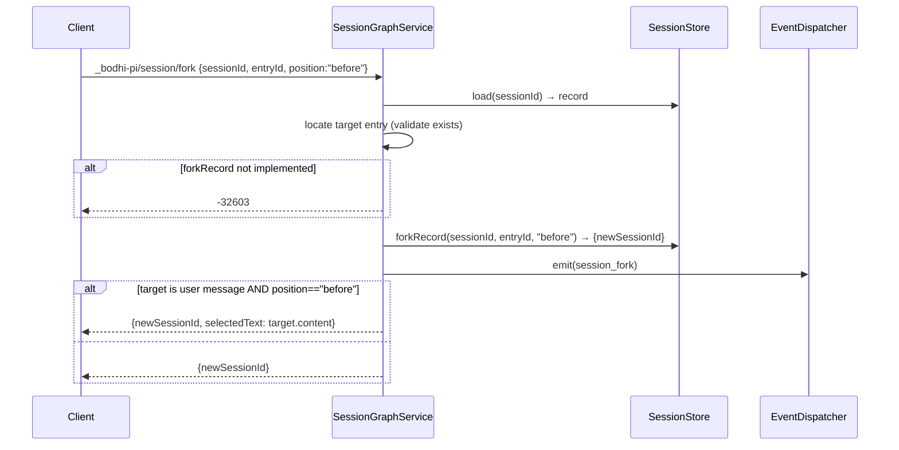
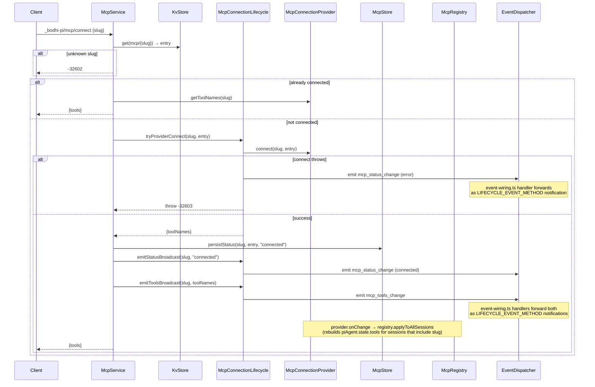
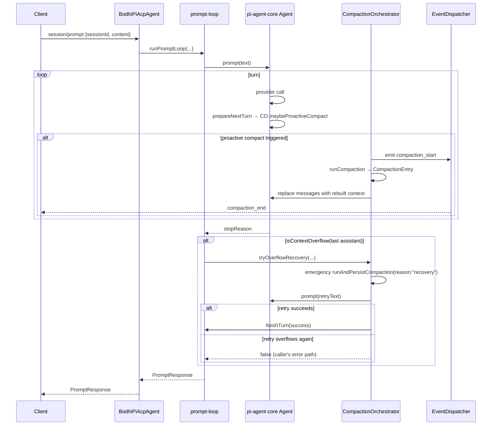
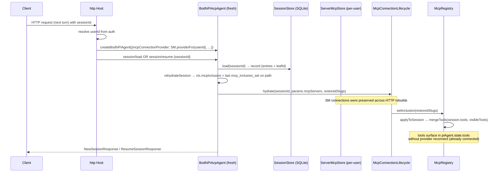

# ACP surface

bodhi-pi speaks the **Agent Client Protocol (ACP)** verbatim for the methods the spec defines, and ships everything else as `_bodhi-pi/<area>/<verb>` extension methods. Capability is advertised in the `initialize` response under `agentCapabilities._meta["bodhi-pi"]` so Clients can negotiate.

## Native ACP methods

Implemented on `BodhiPiAcpAgent` (`src/acp/agent.ts`). The agent does NOT implement `fs/*` or `terminal/*` — those are orthogonal to the host-injected `Filesystem` / `Terminal`.

| Method | File:line | Side effects | Notes |
|---|---|---|---|
| `initialize` | `:314-333` | builds `ExtensionRunner` (so optional-extension failures can be surfaced); `required:true` extension failures throw `-32603` | Returns `protocolVersion:1`, advertises `loadSession:true`, session caps (`list`, `close`, `resume`), `mcpCapabilities:{http:true, sse:false}`, `_meta["bodhi-pi"]: {version, available:{kv,mcp,terminal,scriptExecutor,settings,subagent}, extensions?:{failed:string[]}}`. `available.*` is computed at agent construction from the injected adapter set; Clients can disable/hide UX surfaces for `false` namespaces rather than discover the gap by calling and receiving `-32601`. `available.subagent` is always `true` (SubagentService is unconditionally registered with bundled built-ins); per-session profile count is reachable via `_bodhi-pi/subagent/list`'s `profiles` array length. `extensions.failed[]` lists names of optional extension factories that threw — present only when non-empty. |
| `authenticate` | `:335-337` | none | Stub — returns `{}`. No auth methods advertised |
| `newSession` | `:339-356` | creates SessionRecord, builds SessionState, hydrates MCP (no restored slugs), emits `session_start{reason:"new"}` | Returns `{sessionId, configOptions, _meta?}`. `_meta["bodhi-pi"].mcp.notFoundSlugs:string[]` is set when the request's `mcpServers` referenced slugs not present in KV — see [mcp.md § Hydration flow](./mcp.md#hydration-flow-on-session-boot). Per-slug `mcp_status_change{status:"error", errorMessage:"unknown slug"}` events also fire. |
| `loadSession` | `:358-437` | `rehydrateSession`, **replays history** as `sessionUpdate` notifications, hydrates MCP with restored slugs, emits `session_start{reason:"load"}` | Replays user chunks, tool_call (status:completed), tool_call_update with results/errors. Same `_meta.notFoundSlugs` shape as `newSession` when ephemeral `mcpServers` names unknown slugs. |
| `resumeSession` | `:439-454` | `rehydrateSession`, hydrates MCP, emits `session_start{reason:"resume"}` | **Does not replay** to Client per ACP spec. Same `_meta.notFoundSlugs` shape as `newSession` when ephemeral `mcpServers` names unknown slugs. |
| `listSessions` | `:456-469` | none | Backed by `sessionStore.list({cwd?, cursor?})`. Returns `{sessions:[…], nextCursor?}`. Stores encode `{updatedAt,id}` base64url cursors |
| `closeSession` | `:471-479` | `piAgent.abort()`, `mcpService.closeSession`, drops in-memory state, emits `session_shutdown` | Persisted record remains |
| `setSessionConfigOption` | `:577-595` | `BodhiPiAcpAgent` owns the dispatch; `configId: "model" \| "thinking"` delegate to `ModelRegistry`, `configId: "mode"` delegates to `PermissionService.setMode`. See [modes.md § Dispatch ownership](./modes.md#dispatch-ownership-refactor-delivered-alongside-this-phase). | Returns FULL `configOptions[]` (mode first, then model, then optional thinking). `mode='allow-all'` rejected with `-32603` when `allowsAllowAllMode: false` |
| `prompt` | `:501-507` | runs prompt loop, emits assistant + tool_call updates, may auto-compact + retry on overflow | Throws `-32602` when session not loaded |
| `cancel` | `:519-524` | sets `runtime.cancelled=true`, `piAgent.abort()` | No response (ACP notification) |
| `extMethod` | `:481-485` | dispatches to `extHandlers` map | Returns `-32601` for unknown method names |

## Extension methods (`_bodhi-pi/*`)

All registered in `extHandlers` at `src/acp/agent.ts:256-264`. Each subsection below maps to a `register()` call on a service.

### Session graph methods (`src/sessions/session-graph-service.ts`)

| Method | Params | Response | Side effects | Throws |
|---|---|---|---|---|
| `_bodhi-pi/session/tree` | `{sessionId}` | `{leafId, nodes:[{id,parentId,type,role?,preview?,isLeaf,childCount}]}` | none | `-32602` if unknown session |
| `_bodhi-pi/session/navigate` | `{sessionId, targetEntryId}` | `{leafId}` | sets leafId; on cross-branch: appends `branch_summary` entry; rebuilds `piAgent.state.messages`; emits `session_navigate` (+ `branch_summary_created`) | `-32602` for bad target |
| `_bodhi-pi/session/entries` | `{sessionId}` | `{entries:[{id,role,preview}]}` | none — active-branch messages only | — |
| `_bodhi-pi/session/fork` | `{sessionId, entryId, position?:"before"\|"at"}` | `{newSessionId, selectedText?}` | calls `sessionStore.forkRecord`; emits `session_fork` | `-32603` if store doesn't support forking; `-32602` for bad entry |
| `_bodhi-pi/session/clone` | `{sessionId}` | `{newSessionId}` | `forkRecord(sessionId, leafId, "at")`; emits `session_clone` | `-32603` if empty session or store doesn't support |
| `_bodhi-pi/session/delete` | `{sessionId}` | `{}` | aborts agent, closes MCP, deletes from store, emits `session_shutdown` | — |

### Session info methods (`src/sessions/session-info-service.ts`)

| Method | Params | Response | Side effects |
|---|---|---|---|
| `_bodhi-pi/session/config` | `{sessionId}` | `{sessionId, cwd, defaultModelId, currentModelId, thinkingLevel, retryOptions, compaction, appendSystemPrompt, contextFilePaths, globalSettingsParseError?, projectSettingsParseError?}` | none |
| `_bodhi-pi/session/setName` | `{sessionId, name}` | `{ok:true, name}` | appends `session_info` entry, emits `session_info_update` notification |
| `_bodhi-pi/session/stats` | `{sessionId}` | `{messageCount, toolCallCount, leafId, name?}` | none — walks active path |
| `_bodhi-pi/session/export` | `{sessionId}` | `{format:"jsonl", content}` | none — header line + active-path entries |

### Compaction (`src/sessions/compaction-orchestrator.ts`)

| Method | Params | Response | Side effects | Throws |
|---|---|---|---|---|
| `_bodhi-pi/session/compact` | `{sessionId, customInstructions?}` | `{summary, firstKeptEntryId, tokensBefore, details?}` | appends `CompactionEntry`; rebuilds `piAgent.state.messages`; emits `compaction_start`/`compaction_end` | `-32603` for nothing-to-compact or no API key |

### KV (`src/kv/kv-service.ts`)

| Method | Params | Response | Side effects |
|---|---|---|---|
| `_bodhi-pi/kv/set` | `{key, value, sessionId?}` | `{key}` | emits `auth_change{action:"login"}` if `key` starts with `auth/` |
| `_bodhi-pi/kv/get` | `{key}` | `{key, value: maskedOrNull}` | **secret values masked to `***`** on read |
| `_bodhi-pi/kv/list` | `{prefix?}` | `{entries:[{key, value: masked}]}` | secrets masked |
| `_bodhi-pi/kv/remove` | `{key, sessionId?}` | `{key}` | emits `auth_change{action:"logout"}` if `auth/` key |

Throws `-32601` when host omitted `kvStore`.

### Settings (`src/settings/settings-service.ts`)

`scope` parameter is one of `"global" | "project" | "session"`. `--global` requires Host to have provided `homeDir`; otherwise rejects `-32602`.

| Method | Params | Response | Side effects |
|---|---|---|---|
| `_bodhi-pi/session/settings/get` | `{sessionId, key, scope?}` | `{key, scope, value, effective, source}` | none — `source` is `default`/`global`/`project`/`session` |
| `_bodhi-pi/session/settings/set` | `{sessionId, key, value, scope?}` | `{key, scope, effective}` | writes file (global/project) or `sessionOverrides` (session); emits `settings_change{reason:"set"}` |
| `_bodhi-pi/session/settings/unset` | `{sessionId, key, scope?}` | `{key, scope, effective}` | removes the path at chosen scope; emits `settings_change{reason:"unset"}` |
| `_bodhi-pi/session/settings/list` | `{sessionId, scope?}` | `{scope, settings}` | `scope` defaults to `"effective"` (the merged view) |

`key` is dotted path (e.g. `providerOptions.openai.maxRetries`). String `value`s are JSON-parsed via `parseSettingValue` (so `"123"` becomes `123`, `"true"` becomes `true`); object/array values are passed through.

### MCP (`src/mcp/mcp-service.ts`)

| Method | Params | Response | Side effects | Throws |
|---|---|---|---|---|
| `_bodhi-pi/mcp/add` | `{url, auth: "public" \| "http-param" \| "oauth-preregistered" \| "oauth-dcr", headers?, queries?, authorizeUrl?, tokenUrl?, registrationEndpoint?, issuerUrl?, clientId?, clientSecret?, scopes?, redirectUri?, tokenAuthMethod?, clientName?, label?}` for http; `{command, args?, env?, label?}` for stdio | `{slug}` | writes `mcp/<slug>` to KV (status `disconnected`); tags every header/query/env/clientSecret value `secret:true`; `auth: "oauth-dcr"` additionally runs RFC 9728+8414 discovery and RFC 7591 DCR before persisting | `-32602` if neither `url` nor `command`; `-32602` on auth-shape errors (see [mcp.md § Auth](./mcp.md#auth)); `-32603` on discovery/DCR failure; `-32601` if `command` and `!supportsStdio` |
| `_bodhi-pi/mcp/remove` | `{slug}` | `{slug}` | `provider.disconnect(slug)`, KV remove, emits `mcp_status_change{status:"disconnected"}` | |
| `_bodhi-pi/mcp/connect` | `{slug}` | `{tools:[…]}` | `provider.connect(...)`, status broadcasts, persists `lastKnownStatus:"connected"` | `-32602` unknown slug; `-32603` from provider error |
| `_bodhi-pi/mcp/disconnect` | `{slug}` | `{slug}` | `provider.disconnect`, persists `disconnected`, broadcasts | — |
| `_bodhi-pi/mcp/reconnect` | `{slug}` | `{tools:[…]}` | `provider.reconnect`, broadcasts | `-32602` unknown; `-32603` provider error |
| `_bodhi-pi/mcp/list` | `{}` | `{entries:[{slug,label,transport,status,url?,command?,auth}]}` — `auth` mirrors the persisted blob with secret values masked to `"***"` | live status = `provider.isConnected(slug) ? "connected" : entry.lastKnownStatus` |
| `_bodhi-pi/mcp/tools` | `{sessionId, slug}` | `{tools:[…]}` | per-session visibility (returns `[]` if not included or not connected) |
| `_bodhi-pi/mcp/include` | `{sessionId, slug}` | `{slug, tools}` | adds to inclusion, applies to session, persists `mcp_inclusion_set` | `-32602` unknown slug |
| `_bodhi-pi/mcp/exclude` | `{sessionId, slug}` | `{slug}` | removes from inclusion, applies, persists snapshot | — |
| `_bodhi-pi/mcp/oauth/start` | `{slug, redirectUri?}` | `{authorizeUrl, state} \| {status:"completed"}` | builds `KvOAuthProvider`, runs the auth flow; persists codeVerifier to `OAuthStateKv` under `state` (5-min TTL); emits `mcp_oauth_status_change{status:"started"\|"completed"}` | `-32602` unknown slug or persisted `auth.mode !== "oauth"`; `-32602` if no redirectUri available |
| `_bodhi-pi/mcp/oauth/finish` | `{slug, code, state}` | `{status:"completed" \| "failed", errorMessage?}` | exchanges `code` for tokens; persists to `auth.tokens` (secret-tagged); emits `mcp_oauth_status_change` | `-32602` invalid/expired state |
| `_bodhi-pi/mcp/oauth/cancel` | `{slug, state}` | `{ok: true}` | drops the `OAuthStateKv` entry; emits `mcp_oauth_status_change{status:"cancelled"}` | — |
| `_bodhi-pi/mcp/oauth/discover` | `{url}` (MCP server URL) | `{authorizationServerUrl, authorizeUrl?, tokenUrl?, registrationEndpoint?, scopesSupported?, resource?}` | RFC 9728 + 8414 discovery via SDK's `discoverOAuthServerInfo`; pure read, no kv mutation | `-32603` on discovery failure |
| `_bodhi-pi/mcp/oauth/register` | `{registrationEndpoint, redirectUri, scopes?, clientName?, clientUri?}` | `{clientId, clientSecret?, clientIdIssuedAt?, tokenEndpointAuthMethod?, registrationAccessToken?}` | RFC 7591 DCR via SDK's `registerClient`; pure write to the auth server, no kv mutation | `-32603` on registration failure |

See [mcp.md](./mcp.md) for the connection model and per-tenant ConnectionProvider story.

### Sub-agents (`src/subagents/subagent-service.ts`)

See [subagents.md](./subagents.md) for runtime mechanics and the three contribution sources (project markdown, extension-registered, bundled built-in).

| Method | Params | Response | Side effects | Throws |
|---|---|---|---|---|
| `_bodhi-pi/subagent/list` | `{sessionId}` | `{profiles: SubagentProfileSummary[]}` — merged set across project markdown + extension-registered + built-ins, sorted by name. Each summary includes `source: "project" \| "extension" \| "builtin"`. | none | `-32602` if session not loaded |
| `_bodhi-pi/subagent/run` | `{sessionId, agent, task, model?}` | `{childSessionId, status, summary?, error?, durationMs, toolCount}` | creates child Session via `SubagentService.spawn`, runs prompt loop, returns summary | `-32602` if session not loaded or agent unknown |
| `_bodhi-pi/subagent/children` | `{sessionId}` | `{children: SessionInfo[]}` — list of child sessions whose `parentSessionId === sessionId` AND `subagent !== undefined` | none — drives "runs from this session" UI | `-32602` if session not loaded |

## `session/update` notifications (Agent → Client)

The wire-level streaming surface. Sent via `conn.sessionUpdate(...)`. Internal helpers in `src/acp/notifications.ts`.

| `sessionUpdate` | Carries | When |
|---|---|---|
| `user_message_chunk` | text | history replay in `loadSession`; ephemeral user echo |
| `agent_message_chunk` | text | streaming assistant text |
| `tool_call` | `{toolCallId, title, kind, status, rawInput}` | tool invocation start |
| `tool_call_update` | `{toolCallId, status, content?}` | mid-flight (`in_progress` + content snapshot) and terminal (`completed`/`failed`) |
| `available_commands_update` | `{availableCommands:[…]}` | session boot, after extension `registerCommand`, after `requestSlashableRefresh` |
| `session_info_update` | `{title, updatedAt}` | `_bodhi-pi/session/setName` |
| `current_model_update` | `{modelId}` | `setSessionConfigOption("model", …)` |

## `LIFECYCLE_EVENT_METHOD` notifications

Non-`sessionUpdate` notifications under a single method name `LIFECYCLE_EVENT_METHOD` (`src/wire/constants.ts`). Used for status fan-outs that aren't strictly session-update-shaped. Translation surface is `src/acp/event-wiring.ts`:

- `{type:"mcp_status_change", sessionId, slug, status, errorMessage?, serverTime}`
- `{type:"mcp_tools_change", sessionId, slug, toolNames, serverTime}`
- `{type:"mcp_oauth_status_change", sessionId, slug, status: "started" \| "completed" \| "failed" \| "cancelled", errorMessage?, serverTime}` — own channel (separate from `mcp_status_change`) so UIs can render the "click to authenticate" affordance independently of connect/disconnect. When no session is loaded (e.g. callback lands between session closes), `sessionId` is the empty string `""`.
- `{type:"subagent_start", parentSessionId, childSessionId, profileName, task, toolCallId, depth, contextMode, serverTime}` — emitted when `SubagentService.spawn` creates a child session and is about to run its prompt loop. `profileName` matches the persisted `subagent_link.profileName` + the SessionStore `subagent.profileName` shape so all rails name the field the same. `contextMode: "fresh" \| "fork"` mirrors the profile's `context` field so clients know whether the child inherited the parent transcript. Lets clients open a transcript group keyed by `childSessionId` and route subsequent `sessionUpdate` notifications whose `sessionId === childSessionId` into that group.
- `{type:"subagent_end", parentSessionId, childSessionId, profileName, status: "completed" \| "cancelled" \| "failed", durationMs, toolCount, contextMode, summary?, error?, serverTime}` — emitted after the child's prompt loop terminates (regardless of status) and before the `evictChild` cleanup. `contextMode` matches the corresponding `subagent_start`. Lets clients close their open transcript group and record the terminal status.
- `{type:"tool_blocked", sessionId, toolCallId, toolName, category, mode, reason, serverTime}` — emitted when `PermissionService.evaluateToolCall` returns `{ kind: "deny" }` and `createPiAgent.beforeToolCall` rejects the call. One-shot (no wire round-trip — no `correlationId`). The agent ALSO appends a `custom_message` SessionEntry (`extensionName: "modes"`, `customType: "tool_blocked"`, `content: reason`, `display: true`) so the block joins the persisted transcript and the LLM's next context window. Clients should render the lifecycle event live (the persisted entry is for replay on load). Milestone 030 ships plan-mode enforcement only; ask/edit/allow-all stay inert until 040.

**Parallel sub-agent dispatch.** When the parent LLM emits N `subagent` tool calls in a single assistant message, pi-agent-core's `Promise.all` executor (`packages/agent/src/agent-loop.ts:executeToolCallsParallel`) runs them concurrently. The wire view is N independent `subagent_start` events followed by N independent `subagent_end` events; no batch envelope exists. Clients verify true concurrency by comparing `serverTime` fields: `max(subagent_start.serverTime) <= min(subagent_end.serverTime)` proves the children overlapped in wall-clock time.

**`serverTime` (common field).** Every `LIFECYCLE_EVENT_METHOD` payload carries a `serverTime: number` field — `Date.now()` stamped at event-construction time on the agent. Stamping happens centrally in `src/events/factory.ts::createEvent(type, payload)`, the single supported construction path for `BodhiPiEvent`. Clients can use `serverTime` for ordering across concurrent fan-outs (e.g. proving two `subagent_start` events for sibling children actually overlapped in wall-clock time), audit logs, and replay timelines. The field is typed `serverTime?: number` so test fixtures and pre-factory historical records remain compile-compatible; in production every wire event carries it.

**Mapping policy**: every wire-bound event flows through `src/acp/event-wiring.ts`. Services emit domain events on `EventDispatcher`; `event-wiring.ts` is the sole translation surface that calls `conn.sessionUpdate(...)` / `conn.notification(...)`. `McpConnectionLifecycle` emits `mcp_status_change` / `mcp_tools_change` to the dispatcher only — event-wiring registers handlers that forward them as `LIFECYCLE_EVENT_METHOD` notifications. This keeps SDK extraction tractable (one module owns wire translation) and lets extensions observe the same domain events without subscribing to a wire-shape.

## Error code conventions

| Code | Meaning | Example |
|---|---|---|
| `-32601` | method not found / capability missing | `extMethod` unknown method; `kvStore` not configured; stdio MCP on no-stdio Host |
| `-32602` | invalid params | bad sessionId, unknown slug, bad scope value |
| `-32603` | internal / refused operation | compaction had nothing to do, no API key, session store can't fork |

## Sequence diagram 1 — `_bodhi-pi/session/fork`



## Sequence diagram 2 — Cross-branch `_bodhi-pi/session/navigate`

```mermaid
sequenceDiagram
  participant C as Client
  participant SG as SessionGraphService
  participant CO as CompactionOrchestrator
  participant BS as branch-summary
  participant SS as SessionStore
  participant S as SessionState
  participant ED as EventDispatcher

  C->>SG: _bodhi-pi/session/navigate {sessionId, targetEntryId}
  SG->>SS: load → record
  SG->>SG: detectCrossBranch(entries, oldLeaf, target)
  alt cross-branch
    SG->>CO: runBranchSummaryForNavigate(...)
    CO->>BS: runBranchSummary(abandonedTail, model, apiKey)
    BS-->>CO: {summary, details?}
    alt summary OK
      CO->>S: runtime.leafId = target
      CO->>SS: setLeafId(sessionId, target)
      CO->>SS: append(branch_summary; parentId=target)
      CO->>S: piAgent.state.messages = buildSessionContext(refreshed)
      ED-->>C: branch_summary_created
      ED-->>C: session_navigate{crossedBranches:true}
      SG-->>C: {leafId: target}
    else summary failed
      Note over CO: log + return undefined<br/>(SG falls through to plain navigate)
    end
  else same-branch
    SG->>SS: setLeafId(sessionId, target)
    SG->>S: piAgent.state.messages = buildSessionContext(refreshed)
    ED-->>C: session_navigate{crossedBranches:false}
    SG-->>C: {leafId: target}
  end
```

## Sequence diagram 3 — MCP connect (lazy + status broadcasts)



## Sequence diagram 4 — Prompt with overflow recovery



## Sequence diagram 5 — MCP hydrate-with-restored-inclusion (per-turn rebuild on http)



## See also

- [architecture.md](./architecture.md) — façade composition + service registration map.
- [lifecycle.md](./lifecycle.md) — what `loadSession`/`rehydrateSession`/`prompt` actually do.
- [mcp.md](./mcp.md) — MCP method details + Store/Lifecycle/Registry/Service decomposition.
- `src/wire/constants.ts` — every `EXT_*` method name.
- `src/wire/validators.ts` — shared parameter validators (`requireStringParam`, `validateSessionId`, `optionalSessionId`).
