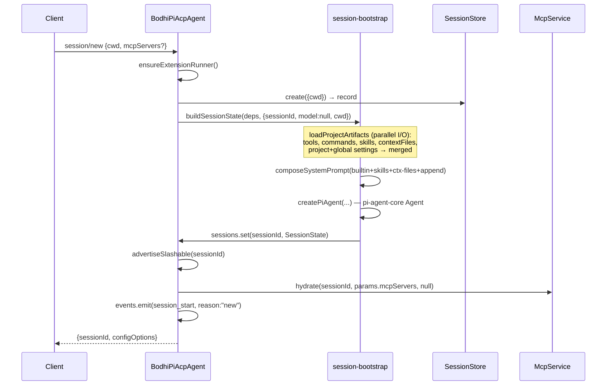

# Session lifecycle

A session is an append-only stream of **SessionEntry** rows persisted in the host-injected `SessionStore`, plus an in-memory `SessionState` that holds the pi-agent-core `Agent`, current model/thinking level, tool list, and the active **leaf**.

## SessionEntry union

Canonical persistence unit. Discriminated by `type`. Source: `src/sessions/entries.ts`.

| Type | Carries | Written by |
|---|---|---|
| `message` | `AgentMessage` (user / assistant / tool_result) | every assistant chunk, every tool round-trip, every user prompt |
| `model_change` | `{provider, modelId}` | `setSessionConfigOption("model", …)` |
| `thinking_change` | `{level}` | `setSessionConfigOption("thinking", …)` |
| `mcp_inclusion_set` | `{slugs: string[]}` (sorted) | `_bodhi-pi/mcp/include`/`exclude`, hydration with ephemeral `mcpServers` |
| `compaction` | `{summary, firstKeptEntryId, tokensBefore, details?, fromHook?}` | `_bodhi-pi/session/compact`, proactive auto-compact, overflow recovery |
| `branch_summary` | `{fromId, summary, details?, fromHook?}` | cross-branch `_bodhi-pi/session/navigate` |
| `session_info` | `{name?}` | `_bodhi-pi/session/setName` |
| `extension` | `{extensionName, customType, data}` | Extension via `ExtensionAPI.appendEntry` |
| `custom_message` | `{extensionName, customType, content, display, details?}` | Extension via `ExtensionAPI.sendMessage` |
| `subagent_link` | `{parentSessionId, profileName, task, toolCallId, depth, contextMode}` | `SubagentService.spawn` — appended as the FIRST entry of a child session (parent is the spawning session, not a sibling SessionEntry). `contextMode: "fresh" \| "fork"` records whether the child inherited a filtered slice of the parent transcript. See [subagents.md](./subagents.md). |
| `subagent_complete` | `{status: "completed"\|"cancelled"\|"failed", summary, durationMs, error?}` | `SubagentService.spawn` — appended after the child's `runPromptLoop` returns (or aborts). Terminal marker for the child run. |

Every entry has `id` (UUID), `parentId` (optional; `null` = root), `timestamp` (ms). The `parentId` chain forms the **Session DAG**.

> `subagent_link` + `subagent_complete` never appear in the parent's session log — they live in the child session, bracketing its transcript. `buildSessionContext` filters both before assembling LLM messages, so they don't reach the model.

> Naming note: `ExtensionEntry.type = "extension"` is what coding-agent calls `custom`. Rename deferred — see CONTEXT.md "Flagged ambiguities".

## The DAG

```
                    root
                     │
                  ┌──┴──┐
              entryA    entryB        ← two siblings: two branches
                │         │
              entryC    entryD ← leaf B
                │
              entryE  ← leaf A (active)
```

- `SessionRecord.leafId` (persisted by `SessionStore.setLeafId()`) is the tip of the **active branch**.
- `walkPath(entries, leafId)` (`src/sessions/build-context.ts`) walks parent links from leaf back to root, reverses, and yields the linear conversation history fed to the LLM.
- A session may have many leaves at once (via fork). `_bodhi-pi/session/tree` reports them all (`isLeaf`, `childCount`).

## Session boot

Three entry points share the same backbone (`src/acp/agent.ts:339-454`):



| Method | Differs from new how? |
|---|---|
| `session/new` | creates a fresh `SessionRecord`; `restoredSlugs=null` for MCP hydration |
| `session/load` | `rehydrateSession` reads entries, extracts current model + thinking + `mcp_inclusion_set`; **replays history** to Client via `conn.sessionUpdate(...)` (user chunks + tool_call + tool_call_update) at `src/acp/agent.ts:373-424` |
| `session/resume` | same `rehydrateSession`, but **does not replay** to Client (per ACP spec) |

`rehydrateSession` (`src/sessions/session-bootstrap.ts:314-348`) returns `{entries, currentModelId, mcpInclusion}`. The `mcpInclusion` is the last `mcp_inclusion_set` entry on the active branch (extracted by `buildSessionContext`); passed through to `mcpService.hydrate(sessionId, ephemeral, restoredSlugs)`.

## Prompt loop

`session/prompt` (`src/acp/agent.ts:501-507`) delegates to `runPromptLoop(deps, session, params)` in `src/acp/prompt-loop.ts`. Two subscribers:

1. **EventDispatcher** routes pi-agent-core hooks (`beforeToolCall`, `afterToolCall`, `onPayload`, `onResponse`, `prepareNextTurn`) — set up at agent construction in `createPiAgent` (`src/sessions/session-bootstrap.ts:142-203`).
2. **`subscribeToAgent`** (`src/acp/prompt-loop.ts`) listens to the pi-agent event bus and translates streamed assistant chunks + tool calls into ACP `session/update` notifications.

`prepareNextTurn` is the proactive-compaction + thinking-flush hook:

```ts
prepareNextTurn: async () => {
  const compactUpdate = await compactionOrchestrator.maybeProactiveCompact(sessionId);
  if (!pendingThinkingLevelChange) return compactUpdate;
  pendingThinkingLevelChange = false;
  return { ...(compactUpdate ?? {}), thinkingLevel };
}
```

(see `src/sessions/session-bootstrap.ts:194-201`)

After the loop returns, the prompt-loop module calls `compactionOrchestrator.tryOverflowRecovery(...)` if the last assistant message looks like a provider-side context overflow (`isContextOverflow` from pi-ai). On success: emergency compaction + retry once (`src/sessions/compaction-orchestrator.ts:214-251`).

## Cancellation

`session/cancel` (`src/acp/agent.ts:519-524`) sets `session.runtime.cancelled = true` and calls `piAgent.abort()`. The abort propagates through pi-agent-core's HTTP client to terminate the in-flight provider request. The prompt loop observes the cancellation and finishes the turn with `stopReason: "cancelled"`.

`cancelled=true` is also checked by `maybeProactiveCompact` (`src/sessions/compaction-orchestrator.ts:177`) so compaction won't kick off mid-cancel.

## Close vs delete

| Method | Effect | Persists? |
|---|---|---|
| `session/close` (`src/acp/agent.ts:471-479`) | abort piAgent, clear MCP inclusion for the session, drop the in-memory `SessionState`, emit `session_shutdown` | YES — record stays in `SessionStore` |
| `_bodhi-pi/session/delete` (`src/acp/agent.ts:487-495`) | same + `sessionStore.delete(sessionId)` | NO — record removed |

## Branch operations

All in `SessionGraphService` (`src/sessions/session-graph-service.ts`):

### `_bodhi-pi/session/tree`
Returns every entry with `{id, parentId, type, role?, preview?, isLeaf, childCount}`. `preview` is the trimmed first 60 chars of message text. Plus the top-level `leafId`. Used by Clients to render the full DAG with branch markers.

### `_bodhi-pi/session/entries`
Returns only `user`/`assistant` message entries on the active branch with previews. Cheaper than `tree` for slash-command pickers (e.g. `/fork`).

### `_bodhi-pi/session/fork`
Creates a new `sessionId` by duplicating the chain from root to a chosen entry. `position: "before"` excludes the target message; `"at"` includes it. Backed by `SessionStore.forkRecord?` (optional — throws `-32603` if the store can't fork). When `position === "before"` and the target is a user message, the response also includes `selectedText` (the text the user can edit before re-sending).

### `_bodhi-pi/session/clone`
`forkRecord(sessionId, currentLeafId, "at")` — same as a fork from the leaf. Whole branch duplicated under a new id.

### `_bodhi-pi/session/navigate`
Switches the active leaf to `targetEntryId`. Two paths:

```mermaid
sequenceDiagram
  participant C as Client
  participant SG as SessionGraphService
  participant CO as CompactionOrchestrator
  participant SS as SessionStore
  participant S as SessionState

  C->>SG: _bodhi-pi/session/navigate {sessionId, targetEntryId}
  SG->>SS: load(sessionId) → record
  SG->>SG: detectCrossBranch(entries, oldLeaf, target)
  alt cross-branch (abandoned tail exists)
    SG->>CO: runBranchSummaryForNavigate(...)
    CO->>CO: walk abandoned tail back to commonAncestor
    CO->>CO: runBranchSummary(tail, model, apiKey)
    alt summary produced
      CO->>SS: setLeafId(sessionId, target)
      CO->>SS: append(branch_summary entry; parentId=target)
      CO->>S: piAgent.state.messages = buildSessionContext(refreshed)
      SG-->>C: {leafId: target}
    else summary failed
      Note over SG: fall through to plain navigate
    end
  else same-branch (ancestor of oldLeaf)
    SG->>SS: setLeafId(sessionId, target)
    SG->>S: piAgent.state.messages = buildSessionContext(refreshed)
    SG-->>C: {leafId: target}
  end
```

Cross-branch detection: if the target's `parentId` chain does NOT include `oldLeaf`, navigation crosses a branch. The summary call walks `oldLeaf → commonAncestor` and asks the active model to summarize it. On any failure the system falls through to a plain navigate — branch summary is best-effort.

## Compaction

Two triggers, one machine.

| Trigger | Initiated by | Behaviour on failure |
|---|---|---|
| Manual | `_bodhi-pi/session/compact` | re-throws (errors flow back to Client) |
| Proactive | `prepareNextTurn` hook between turns + post-prompt `checkAutoCompact` fallback | swallowed |
| Overflow recovery | `prompt-loop` after detecting `isContextOverflow` on last assistant message | swallowed; retry attempted once per session |

All paths go through `CompactionOrchestrator.runAndPersistCompaction(sessionId, session, reason, options)` which:

1. Walks the active path.
2. `prepareCompaction(path, settings)` decides what to summarize and what to keep verbatim (`firstKeptEntryId` is the boundary).
3. Resolves API key for the current model.
4. `runCompaction(preparation, model, apiKey, customInstructions?)` calls the LLM.
5. Appends `CompactionEntry` to the session log via `appendEntry`.
6. Reloads + rebuilds context → swaps `piAgent.state.messages`.

The discriminated outcome `{kind: "skipped" | "succeeded" | "failed"}` lets manual callers re-throw and background callers swallow.

## How an entry is appended (`appendEntry`)

The bridge between in-memory state and persistence (`src/acp/agent.ts:267-272`):

```ts
private async appendEntry(sessionId, session, entry) {
  entry.parentId = session.runtime.leafId;            // link to current leaf
  await sessionStore.append(sessionId, entry);
  session.runtime.leafId = entry.id;                  // advance leaf in-memory
  await sessionStore.setLeafId(sessionId, entry.id); // persist leaf for stateless rebuild
}
```

`setLeafId` is a required `SessionStore` method: every in-tree store implements it (in-memory updates a field; SQLite/Dexie persist so per-turn-rebuild Hosts like `test-apps/http` see the right leaf after restart). Tree-aware features (compaction, fork, branch summary, navigate) depend on it.

## Settings layering (touches every entry above)

Resolved at `buildSessionState`:

```
defaults
  └─ overlay: <homeDir>/.bodhi-pi/settings.json    (loadGlobalSettings; Node Hosts only)
       └─ overlay: <cwd>/.bodhi-pi/settings.json   (loadProjectSettings; walks cwd ancestors)
            └─ overlay: BodhiPiConfig fields       (host-explicit, factory-time)
                 └─ overlay: setSessionConfigOption (live mutations)
```

The merge happens via `mergeSettings(...)`. Per-key effective value + source (`global` / `project` / `session` / `default`) is reported by `_bodhi-pi/session/settings/get`. See [acp.md § Settings methods](./acp.md#settings-methods) and the full layered story in [configuration.md](./configuration.md).

## See also

- [acp.md](./acp.md) — per-method reference for the verbs above.
- [mcp.md § Hydration flow](./mcp.md#hydration-flow-on-session-boot) — how MCP slugs are restored on load.
- `src/sessions/build-context.ts` — `walkPath` + `buildSessionContext` (linearises the DAG into the LLM message list).
- `src/sessions/branch-summary.ts` — `runBranchSummary` (LLM call for abandoned-tail summarization).
- `ai-docs/plans/we-want-to-start-jazzy-owl.md` — original session-feature plan (compaction, fork, clone, navigate).
