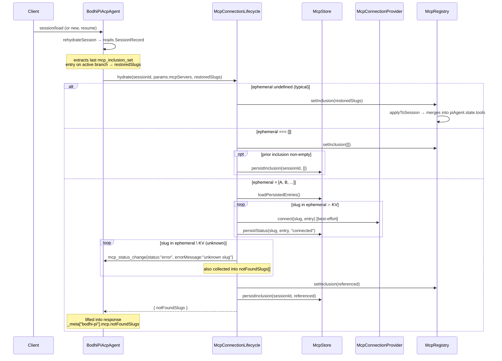

# MCP (Model Context Protocol)

External tool providers, transport-pluggable, per-session scoped via inclusion sets. **Connections are global per `<Host, slug>`; visibility is per-session.** This separation drives the recent decomposition.

## Why the decomposition (recent change)

Before: `McpService` was a monolith mixing KV persistence, transport lifecycle, per-session visibility, and ACP method handling. Three concerns kept tripping over each other — most painfully on multi-tenant Hosts (http) where the agent rebuilds every turn but connections must persist.

After (commits `2746a86b` decompose, `90da4ffa` dedupe, `6a3966f4` remove un-e2e-covered auth variants):

```
McpService                ← ACP method handlers + orchestration
   ├─ McpStore            ← KV reads/writes + per-session inclusion-entry append
   ├─ McpConnectionLifecycle  ← connect/disconnect/reconnect + hydrate + status broadcasts
   ├─ McpRegistry         ← per-session inclusion sets + tool fanout to piAgent.state.tools
   └─ McpConnectionProvider   ← host-injected; owns transports + per-<host,slug> connections
```

Source: `src/mcp/mcp-service.ts:47-100`. Plan that drove it: `ai-docs/plans/20260515-mcp-3-connection.md`. Target shape: `ai-docs/plans/2026-05-16-mcp-target-spec.md`.

## Core types

`McpServerEntry` (`src/mcp/mcp-types.ts`) — persisted shape:

```ts
{
  transport: "http" | "stdio";
  url?: string;                       // when transport === "http"
  command?: string;                   // when transport === "stdio"
  args?: string[];
  env?: McpNamedSecret[];             // tagged secret:true; masked on ACP reads
  auth:                               // persisted discriminator (`mode`)
    | { mode: "public" }
    | { mode: "http-param";
        headers?: McpNamedSecret[];   // tagged secret:true; masked on ACP reads
        queries?: McpNamedSecret[];   // tagged secret:true; masked on ACP reads
      }
    | { mode: "oauth";                // unified OAuth shape — populated via auth: "oauth-preregistered"
        authorizeUrl: string;         //   or auth: "oauth-dcr" on /mcp add (see below)
        tokenUrl: string;
        clientId: string;
        clientSecret?: McpNamedSecret; // tagged secret:true; masked on ACP reads
        scopes?: string[];
        redirectUri?: string;          // optional per-runtime default override
        tokenAuthMethod?: "basic" | "post"; // default "basic"
        tokens?: {
          access: McpNamedSecret;
          refresh?: McpNamedSecret;
          expiresAt?: number;          // unix epoch ms
          tokenType?: string;          // usually "Bearer"
        };
        dcrInfo?: {                    // populated when entry was created via auth: "oauth-dcr"
          issuerUrl: string;
          registrationEndpoint: string;
          registeredAt: number;
          registrationAccessToken?: McpNamedSecret; // RFC 7592 management token, secret:true
        };
      };
  label: string;
  addedAt: string;                    // ISO timestamp
  lastKnownStatus: "connected" | "disconnected" | "error";
}
```

`McpInclusionEntry` (`src/sessions/entries.ts:37-40`) — per-session snapshot:

```ts
{ type: "mcp_inclusion_set"; slugs: string[]; /* + id/parentId/timestamp */ }
```

Persisted under KV: `mcp/<slug>` → `serializeMcpServerEntry(entry)`. Listed via prefix scan in `McpStore.loadPersistedEntries()` at `src/mcp/mcp-store.ts:33-43`.

## The four classes

### McpStore (`src/mcp/mcp-store.ts`)

Pure persistence. No transport, no broadcasts.

- `requireKv(method)` — throws `-32601` when host omitted `kvStore`. Lines 26-31.
- `loadPersistedEntries()` — KV prefix scan, parses each, returns `{slug, entry}[]`. Lines 33-43.
- `persistStatus(slug, entry, status)` — writes `{...entry, lastKnownStatus: status}` back to KV. Lines 45-52.
- `persistInclusion(sessionId, slugs)` — appends an `mcp_inclusion_set` entry to the session log (sorted slugs for stable diffs). Lines 54-65.

### McpRegistry (`src/mcp/mcp-registry.ts`)

Per-session inclusion sets + tool fanout.

- Internal state: `Map<sessionId, Set<slug>>` (line 13).
- `setInclusion / addInclusion / removeInclusion / clearInclusion` mutate the set, then call `applyToSession`.
- `getVisibleTools(sessionId)` — union over (included ∩ connected) slugs' tools. Lines 49-58.
- `applyToSession(sessionId)` — `mergeTools(session.tools, visible)` then writes to `piAgent.state.tools`. Lines 67-72.
- `applyToAllSessions()` — called when the provider's connection map changes (see provider `onChange` hook). Lines 74-78.

### McpConnectionLifecycle (`src/mcp/mcp-connection-lifecycle.ts`)

Connection-lifecycle behaviours that need to coordinate Store + Registry + provider together.

- `hydrate(sessionId, ephemeral, restoredSlugs) → { notFoundSlugs }` — three-way semantics:
  - `ephemeral === undefined` → restore from `restoredSlugs` (no new entry); `notFoundSlugs: []`.
  - `ephemeral === []` → empty inclusion (writes new entry only if there was prior non-empty); `notFoundSlugs: []`.
  - `ephemeral === [A, B, …]` → connect + include named slugs from KV, write new snapshot. **Unknown slugs are dropped and surfaced two ways**: collected into the returned `notFoundSlugs` array (lifted into `_meta["bodhi-pi"].mcp.notFoundSlugs` on the session-bootstrap response by the agent) AND emitted as per-slug `mcp_status_change{status:"error", errorMessage:"unknown slug"}` events (both on the EventDispatcher and on the ACP wire via `LIFECYCLE_EVENT_METHOD`). `session/new` still succeeds — the unknown slug is a visibility signal, not a failure.
- `tryProviderConnect / tryProviderReconnect` — wrap provider calls with error → `-32603` translation + `emitStatusBroadcast(slug, "error", msg)`. Lines 89-109.
- `emitStatusBroadcast(slug, status, errorMessage?)` — emits to `EventDispatcher` AND sends a `LIFECYCLE_EVENT_METHOD` notification on the ACP wire. Fans out across every loaded session. Lines 111-123.
- `emitToolsBroadcast(slug, toolNames)` — analogous, but for tool-name changes. Lines 125-132.

### McpConnectionProvider (`src/mcp/mcp-connection-provider.ts`)

Host-injected; owns transports. Single-tenant default at `src/mcp/in-process-provider.ts`. Multi-tenant Hosts (http) inject a per-user provider so `_bodhi-pi/mcp/*` methods reach the correct user's connections across per-turn agent rebuilds.

Interface methods (paraphrased):
- `connect(slug, entry) → { toolNames }` / `reconnect(...)` / `disconnect(slug)`
- `isConnected(slug)` / `getTools(slug) → AgentTool[] | null` / `getToolNames(slug) → string[] | null`
- `onChange(cb)` — provider notifies registry to recompute visible tools.

### McpService (`src/mcp/mcp-service.ts`)

The ACP-facing orchestrator. Holds Store, Lifecycle, Registry instances; wires `provider.onChange(() => registry.applyToAllSessions())` in the constructor (`mcp-service.ts:73`).

Method handlers map directly to extension methods — see [acp.md § MCP methods](./acp.md#mcp-methods).

## Auth

`auth` is a **top-level discriminator** on `_bodhi-pi/mcp/add` and in the persisted `McpServerEntry`. Three modes are supported today; the `oauth-dcr` mode (Dynamic Client Registration) is tracked separately under `ai-docs/prompts/bodhi-pi-mcp-auth-oauth-dcr.md` and reuses the same envelope shape.

| `auth` | Sibling fields | Applied where |
|---|---|---|
| `"public"` | (none) | No credentials. Sibling `headers`/`queries` → `-32602`. |
| `"http-param"` | `headers?: Record<string,string>`; `queries?: Record<string,string>` | Headers attach via `requestInit.headers`; queries append to `URL.searchParams` before constructing `StreamableHTTPClientTransport`. Both are sent on every request against the server. At least one of `headers` or `queries` must be non-empty — otherwise `-32602`. |
| `"oauth-preregistered"` | `authorizeUrl`, `tokenUrl`, `clientId` (required); `clientSecret`, `scopes`, `redirectUri`, `tokenAuthMethod` (optional) | Persists as `mode: "oauth"`. OAuth 2.1 authorization-code-with-PKCE flow driven by `@modelcontextprotocol/sdk/client/auth.auth()`. The `KvOAuthProvider` (`src/mcp/mcp-oauth-provider.ts`) implements `OAuthClientProvider`, persists tokens to `auth.tokens` under `mcp/<slug>`, and short-circuits RFC 8414 discovery by returning the user-supplied URLs from `discoveryState()`. `validateResourceURL` returns `undefined` so RFC 8707 resource indicators are skipped per the bodhi-pi contract. The transport's `opts.fetch` injects `Authorization: Bearer <access>` per request — read from kv each call so refreshes flow through automatically. |
| `"oauth-dcr"` | `url` (the MCP server URL, required); optional overrides: `issuerUrl`, `authorizeUrl`, `tokenUrl`, `registrationEndpoint`, `clientId`, `clientSecret`, `scopes`, `redirectUri`, `tokenAuthMethod`, `clientName` | Persists as `mode: "oauth"` with `dcrInfo` set. Server runs RFC 9728 (`/.well-known/oauth-protected-resource`) → RFC 8414 (`/.well-known/oauth-authorization-server`) → RFC 7591 (`POST <registration_endpoint>`) via SDK helpers `discoverOAuthServerInfo` + `registerClient`. Any override short-circuits the corresponding discovery/DCR step. If `clientId` override is supplied, DCR is skipped entirely (fallback to pre-registered shape, no `dcrInfo`). Once `/mcp add` returns, the entry behaves identically to a pre-registered one — same `oauth/start/finish/cancel` handlers, same refresh strategy, same callback wiring. |

`_bodhi-pi/mcp/add` examples:

```text
/mcp add {"url":"https://example/mcp", "auth":"public"}
/mcp add {"url":"https://example/mcp", "auth":"http-param", "headers":{"Authorization":"Bearer X"}}
/mcp add {"url":"https://example/mcp", "auth":"http-param", "queries":{"api_key":"k1"}}
/mcp add {"url":"https://example/mcp", "auth":"http-param", "headers":{"Authorization":"Bearer X"}, "queries":{"api_key":"k1"}}
/mcp add {"url":"https://example/mcp", "auth":"oauth-preregistered",
          "authorizeUrl":"https://auth.example.com/authorize",
          "tokenUrl":"https://auth.example.com/token",
          "clientId":"cid-abc", "clientSecret":"sek-shh",
          "scopes":["repo","read"], "redirectUri":"http://localhost:7777/callback"}
```

Validation (`src/mcp/mcp-service.ts:parseAuthInput`):
- `auth` must be `"public"`, `"http-param"`, or `"oauth-preregistered"` (other values → `-32602`).
- `auth: "public"` with sibling `headers` / `queries` → `-32602` (refuses silent attachment).
- `auth: "http-param"` with no headers AND no queries → `-32602` (an empty `http-param` entry is indistinguishable from `"public"` and is a likely bug).
- `auth: "oauth-preregistered"` requires non-empty `authorizeUrl`, `tokenUrl`, `clientId`; URLs must be `https:` (or `http://localhost*` for fixture); sibling `headers`/`queries` → `-32602`; persisted `tokens` field on add → `-32602` (owned by the oauth handler).
- `headers` / `queries` must be `{ [name]: string }` objects; non-string values → `-32602`. Duplicate header names are not supported (JSON-object input).
- stdio entries (`transport === "stdio"`) reject `auth` (any non-`public`), `headers`, and `queries` outright; stdio has no HTTP auth concept.

### OAuth flow (oauth-preregistered)

The flow runs over three ACP extension methods plus a lifecycle event:

| Method | Params | Result | Behavior |
|---|---|---|---|
| `_bodhi-pi/mcp/oauth/start` | `{slug, redirectUri?}` | `{authorizeUrl, state} \| {status:"completed"}` | Builds `KvOAuthProvider`, calls `runAuthFlow(tokenUrl)`. Returns `{status:"completed"}` when the SDK refreshed an existing token without a redirect; otherwise returns the authorize URL + a CSRF state token. The codeVerifier is persisted to `OAuthStateKv` (5-min TTL) under the state key. |
| `_bodhi-pi/mcp/oauth/finish` | `{slug, code, state}` | `{status:"completed" \| "failed", errorMessage?}` | Validates `state`, looks up the codeVerifier, exchanges `code` for tokens via `auth(provider, {authorizationCode})`. Persists tokens to `auth.tokens`. Emits `mcp_oauth_status_change`. |
| `_bodhi-pi/mcp/oauth/cancel` | `{slug, state}` | `{ok: true}` | Drops the `OAuthStateKv` entry; a later `oauth/finish{state}` errors with `-32602`. Emits `mcp_oauth_status_change{cancelled}`. |

Per-runtime callback capture varies — see [acp.md § MCP methods](./acp.md#mcp-methods) and the individual runtime sections of [hosts.md](./hosts.md):

- **CLI**: `test-apps/cli/src/host/oauth-callback-server.ts` binds an ephemeral `http://127.0.0.1:7777/callback` for the flow duration. The `/mcp oauth start <slug>` slash blocks on the `mcp_oauth_status_change{completed|failed}` lifecycle notification (5-min timeout); test mode passes `--auto` so the slash also fetches the authorize URL itself, letting cli-headless e2e run end-to-end without a browser.
- **HTTP+WS**: `test-apps/http/src/host/oauth-callback.ts` handles `GET /oauth/callback` on the existing server. State tokens carry a `<base64url(userId)>.<random>` prefix (see `decodeTenantFromState` in `src/mcp/mcp-service.ts`) so the route opens the right user's kvStore and runs the flow directly, without a live agent.
- **Browser**: `test-apps/browser/src/client/react/OAuthCallback.tsx` is a standalone React component rendered at `/oauth/callback` inside a popup window (detected statically in `main.tsx` so the Worker isn't booted). It parses `?code=&state=`, `postMessage`s to `window.opener`, and closes itself; the opener's chat-slash dispatcher matches the state and calls `_bodhi-pi/mcp/oauth/finish` over ACP.
- **Chrome-ext**: same `test-apps/browser/src/client/lib/commands.ts` slash but branches on `chrome.identity.launchWebAuthFlow` availability. `chrome.identity.getRedirectURL()` (`https://<ext-id>.chromiumapp.org/`) is the `redirectUri`; Chrome manages the auth window and returns the full redirect URL synchronously. Manifest needs `"permissions": ["identity"]` + `"host_permissions"` for the fixture host.

### Token refresh

Implemented in `src/mcp/mcp-client.ts` inside the `oauth-preregistered` attacher's `opts.fetch` closure (per-request scope). Two prongs:

1. **Eager** — before every outbound request, check `tokens.expiresAt - 60_000 < Date.now()`. If true and `tokens.refresh` is present, call `refreshOauthTokens` (which builds a fresh `KvOAuthProvider` and runs `auth(provider, {serverUrl: tokenUrl})` with no `authorizationCode` — the SDK takes the refresh-token path and writes new tokens via `provider.saveTokens`). Re-read the entry and proceed.
2. **Lazy** — on a `401` response from the MCP server (the eager path failed or the server early-revoked), refresh once and retry the request with the new bearer. Single retry, no loops.

Parallel requests share one in-flight refresh via a per-transport gate (`inFlightRefresh: Promise<void> | null`) so the OAuth server never sees two simultaneous refresh-grant calls with the same single-use `refresh_token`. `KvOAuthProvider` deliberately does NOT implement `invalidateCredentials` — the SDK would otherwise delete persisted tokens on a transient refresh race, making every subsequent request send no Authorization header. Re-auth after a real server-side revocation goes through the interactive `_bodhi-pi/mcp/oauth/start` flow.

Internally, every header/query value is tagged as a secret: the parser lifts each `{ [name]: value }` entry into `{ name, value, secret: true }` (`McpNamedSecret`). `maskSecrets` (`src/kv/kv-store.ts`) walks the persisted blob and replaces `value` strings on `{value, secret:true}` nodes with `"***"` on every ACP-boundary read (`EXT_KV_GET`, `EXT_KV_LIST`, `EXT_MCP_LIST`). In-process callers (the MCP connection layer in particular) see plaintext.

`_bodhi-pi/mcp/list` carries the full auth blob in each item's `auth` field — same shape as the persisted entry, with secret values masked. UIs can read it directly to render "uses Authorization + api_key" without ever holding plaintext.

## Transport gating

`BodhiPiConfig.supportsMcpStdio` (default `true`) gates stdio at **add** time, not at connect time — fail loud and early. Set to `false` in Hosts that can't spawn:

- `test-apps/browser/` (Web Worker — no `child_process`)
- `test-apps/chrome-ext/` (service worker — same constraint)
- Stateless rebuild Hosts where a persistent stdio child would leak across requests (`test-apps/http/` per-connection variant)

`_bodhi-pi/mcp/add` with `command=…` then rejects with `-32601` instead of silently persisting an unusable entry (`src/mcp/mcp-service.ts:109-111`).

## Hydration flow on session boot



## Tool namespacing

MCP tools are renamed `<slug>__<original-name>` by `src/mcp/mcp-tool-adapter.ts` so the model never sees collisions between two MCP servers exposing similarly-named tools, and so permission/routing layers can split on the prefix. The pi-agent-core tool list is the union of:

```
builtinTools ⊕ extensionTools ⊕ mcpTools(perSession via inclusion)
```

via `mergeTools(...)` (`src/extensions/merge.ts`). When provider connections change, `McpRegistry.applyToAllSessions()` rebuilds the union for every loaded session so the LLM sees the updated catalogue on the next turn.

## Status broadcasts

Two broadcasts go out on connection state changes:

| Event | Payload | When |
|---|---|---|
| `mcp_status_change` | `{slug, status, errorMessage?}` | on connect/disconnect/reconnect success or failure |
| `mcp_tools_change` | `{slug, toolNames}` | on successful connect/reconnect |

Both are emitted via `EventDispatcher` AND sent as a `notification({method: LIFECYCLE_EVENT_METHOD, params})` to the ACP wire so Clients can update UI without polling.

## Multi-tenant story (http reference Host)

`test-apps/http/src/server/mcp/server-mcp-store.ts` implements `McpConnectionProvider` bound to a per-user SQLite-backed connection map. Server-level singleton; injected per-request into the freshly-built `BodhiPiAcpAgent`:

1. Request arrives with auth → server resolves `userId`.
2. Server constructs `BodhiPiAcpAgent` with `mcpConnectionProvider: serverStore.providerFor(userId)`.
3. Agent processes prompt; tool calls reach the user's existing MCP connection (no reconnect).
4. Request ends; agent is discarded; `serverStore` retains connections for next request.

This is why the connection abstraction is **provider-injected** rather than an internal class: it lets the Host own connection-state durability across agent rebuilds. The `in-process-provider.ts` default works for embedded single-tenant Hosts because connections live as long as the Host process.

## Edge cases & gotchas

- **Orphan-tolerant inclusion**: `_bodhi-pi/mcp/include` succeeds even when the slug isn't currently connected. Tools appear automatically when the provider eventually connects (via `onChange → applyToAllSessions`).
- **Sort-stable inclusion entries**: `McpStore.persistInclusion` sorts slugs before writing so two semantically-equivalent inclusion sets serialize identically.
- **`mcp/remove` always disconnects first**: prevents a dangling provider connection after the KV entry is gone (`src/mcp/mcp-service.ts:133-140`).
- **`mcp/connect` short-circuits if already connected**: returns the cached tool names from the provider without re-establishing (`src/mcp/mcp-service.ts:148-150`).
- **`mcp/disconnect` does NOT clear inclusion**: visibility persists; tools just don't surface until the next connect. This is why `mcp_status_change` matters — Clients render the slug as "included but offline".
- **`closeSession` clears per-session inclusion** but does NOT disconnect — other loaded sessions may still need the slug.

## Tests

- `test/mcp.test.ts` — service-level behaviour with stub provider.
- `test/mcp-http-integration.test.ts` — real HTTP MCP server via `spawnMcpEverything` helper.
- `test/mcp-stdio-integration.test.ts` — real stdio MCP server (same harness).
- `test/extensions.test.ts` — cross-session inclusion exclude (added in commit `90da4ffa`).
- Per-Host e2e in each `test-apps/*/e2e/`.

## See also

- [acp.md § MCP methods](./acp.md#mcp-methods) — request/response shapes + error codes.
- [lifecycle.md § Session boot](./lifecycle.md#session-boot) — where `mcpService.hydrate` fits in `newSession` / `loadSession` / `resumeSession`.
- [hosts.md](./hosts.md) — which Hosts pass `supportsMcpStdio: false` and which inject custom providers.
- `ai-docs/plans/20260515-mcp-0-research.md` — comparative research (Zed, opencode, mcp-typescript-sdk).
- `ai-docs/plans/20260515-mcp-3-connection.md` — primary plan that drove the decomposition.
- `ai-docs/plans/2026-05-16-mcp-target-spec.md` — post-cleanup target shape.
